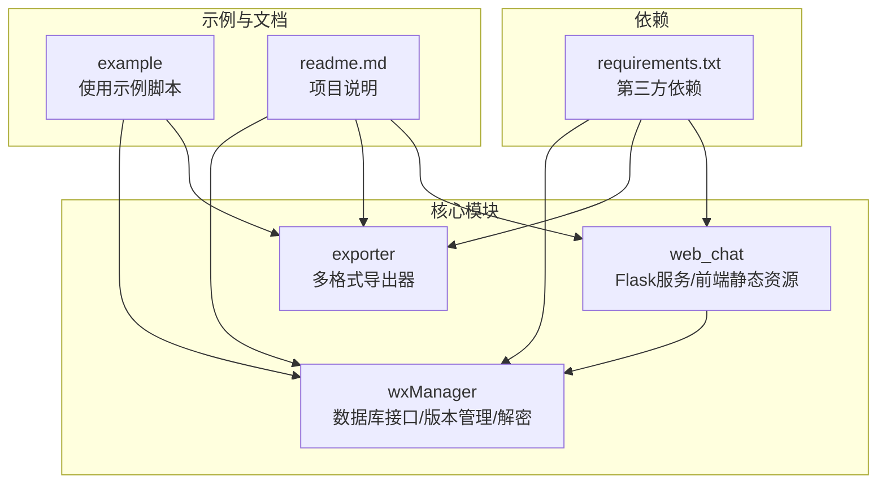
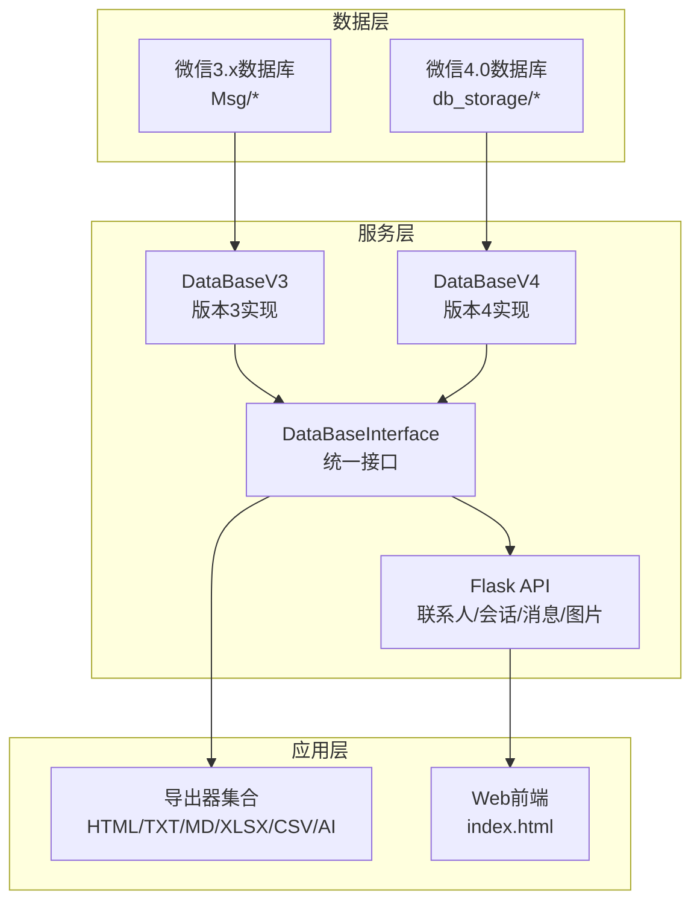
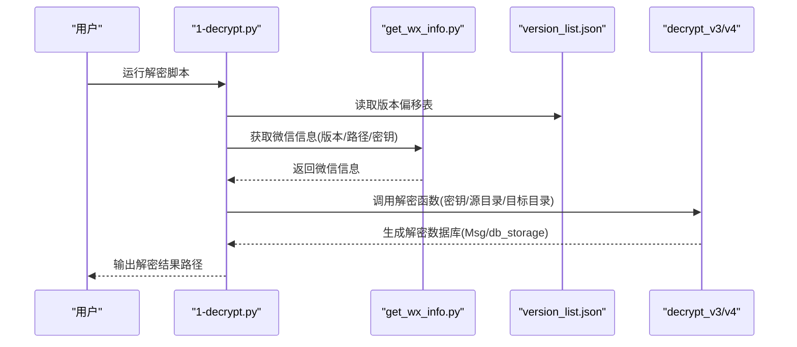
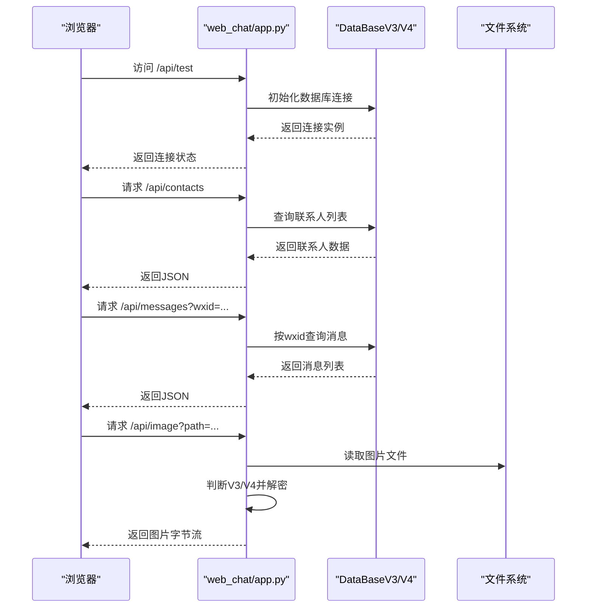
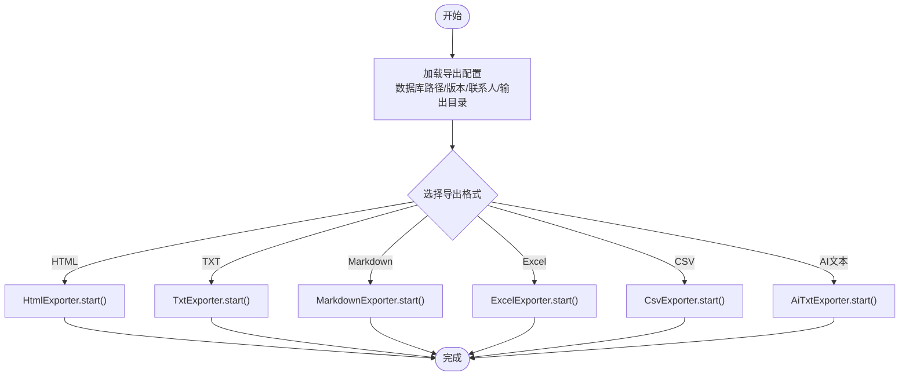
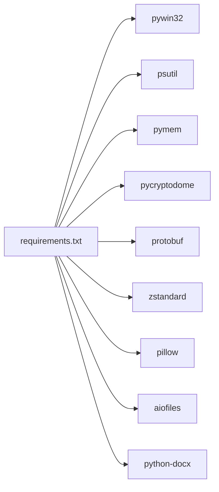

# 快速开始

<cite>
**本文引用的文件**
- [readme.md](file://readme.md)
- [requirements.txt](file://requirements.txt)
- [1-decrypt.py](file://1-decrypt.py)
- [example/README.md](file://example/README.md)
- [example/1-decrypt.py](file://example/1-decrypt.py)
- [example/2-contact.py](file://example/2-contact.py)
- [example/3-exporter.py](file://example/3-exporter.py)
- [wxManager/db_main.py](file://wxManager/db_main.py)
- [wxManager/manager_v3.py](file://wxManager/manager_v3.py)
- [wxManager/manager_v4.py](file://wxManager/manager_v4.py)
- [wxManager/decrypt/get_wx_info.py](file://wxManager/decrypt/get_wx_info.py)
- [wxManager/decrypt/version_list.json](file://wxManager/decrypt/version_list.json)
- [exporter/config.py](file://exporter/config.py)
- [exporter/exporter.py](file://exporter/exporter.py)
- [web_chat/app.py](file://web_chat/app.py)
</cite>

## 目录
1. [简介](#简介)
2. [项目结构](#项目结构)
3. [核心组件](#核心组件)
4. [架构总览](#架构总览)
5. [详细组件分析](#详细组件分析)
6. [依赖分析](#依赖分析)
7. [性能考量](#性能考量)
8. [故障排查指南](#故障排查指南)
9. [结论](#结论)
10. [附录](#附录)

## 简介
MemoTrace 是一款面向微信本地数据库的解析与导出工具，支持微信3.x与4.0版本，提供数据库解密、联系人与聊天记录查询、多格式导出以及Web聊天界面展示能力。本“快速开始”旨在帮助新手在30分钟内完成安装、运行与基础使用，并提供进阶配置参考。

## 项目结构
项目采用按功能域划分的组织方式，核心模块包括：
- wxManager：数据库抽象、版本管理、解密与解析
- exporter：多格式导出器（HTML、TXT、Markdown、Excel、CSV、AI文本等）
- web_chat：基于Flask的Web聊天服务，提供联系人与消息API
- example：使用示例脚本，演示解密、联系人查询与导出流程
- MemoAI：AI相关资源与示例（可选）

图表来源
- [requirements.txt:1-22](file://requirements.txt#L1-L22)
- [readme.md:108-138](file://readme.md#L108-L138)

章节来源
- [readme.md:108-138](file://readme.md#L108-L138)
- [requirements.txt:1-22](file://requirements.txt#L1-L22)

## 核心组件
- 数据库接口与版本适配
  - 抽象接口定义统一的数据访问能力，具体实现分别针对微信3.x与4.0版本。
- 解密与信息提取
  - 通过内存扫描与注册表/配置文件定位微信数据目录与密钥，生成解密所需的参数。
- 导出器
  - 提供HTML、TXT、Markdown、Excel、CSV、AI文本等多种导出格式，支持按类型与时间范围筛选。
- Web服务
  - 提供联系人、会话、消息查询与图片解密API，内置前端页面，便于浏览与导出。

章节来源
- [wxManager/db_main.py:22-251](file://wxManager/db_main.py#L22-L251)
- [wxManager/manager_v3.py:173-699](file://wxManager/manager_v3.py#L173-L699)
- [wxManager/manager_v4.py:71-485](file://wxManager/manager_v4.py#L71-L485)
- [exporter/config.py:4-34](file://exporter/config.py#L4-L34)
- [web_chat/app.py:75-79](file://web_chat/app.py#L75-L79)

## 架构总览
整体架构分为三层：数据层（微信数据库）、服务层（数据库接口与Web API）、应用层（导出器与前端）。

图表来源
- [wxManager/db_main.py:22-251](file://wxManager/db_main.py#L22-L251)
- [wxManager/manager_v3.py:173-699](file://wxManager/manager_v3.py#L173-L699)
- [wxManager/manager_v4.py:71-485](file://wxManager/manager_v4.py#L71-L485)
- [web_chat/app.py:63-776](file://web_chat/app.py#L63-L776)
- [exporter/exporter.py:82-200](file://exporter/exporter.py#L82-L200)

## 详细组件分析

### 安装与环境准备
- 操作系统与Python版本
  - 项目明确不支持Windows 7；建议使用Windows 10/11并使用Python 3.8及以上版本。
- 依赖安装
  - 使用项目提供的依赖清单安装所需第三方库，确保Crypto、protobuf、zstd等关键库可用。
- 可执行文件运行
  - 下载打包好的exe可执行文件，双击即可运行；如遇闪退，右键以管理员身份运行。

章节来源
- [readme.md:123-137](file://readme.md#L123-L137)
- [requirements.txt:1-22](file://requirements.txt#L1-L22)

### 使用方式一：可执行文件直接运行
- 步骤
  - 下载并解压可执行文件包，双击运行。
  - 若出现闪退，右键选择“以管理员身份运行”。
- 注意事项
  - 程序不会主动联网，若杀毒软件提示风险，可选择忽略。

章节来源
- [readme.md:110-115](file://readme.md#L110-L115)

### 使用方式二：源码运行
- 准备工作
  - 安装依赖：pip install -r requirements.txt
  - 确保Python路径包含项目根目录，以便导入wxManager模块。
- 基础流程
  - 解密微信数据库 → 查询联系人 → 导出数据 → 可选：启动Web服务查看聊天记录

章节来源
- [example/README.md:1-64](file://example/README.md#L1-L64)
- [requirements.txt:1-22](file://requirements.txt#L1-L22)

### 基础使用流程

#### 1) 微信数据库解密
- 自动获取微信信息与密钥
  - 通过内存扫描与注册表/配置文件定位微信数据目录与密钥，生成解密参数。
- 生成解密后的数据库
  - v3版本：输出目录包含Msg文件夹
  - v4版本：输出目录包含db_storage文件夹
- 示例脚本
  - 使用示例脚本自动解密并生成info.json，供后续查询与导出使用。

图表来源
- [example/1-decrypt.py:30-87](file://example/1-decrypt.py#L30-L87)
- [wxManager/decrypt/get_wx_info.py:283-308](file://wxManager/decrypt/get_wx_info.py#L283-L308)
- [wxManager/decrypt/version_list.json:1-200](file://wxManager/decrypt/version_list.json#L1-L200)

章节来源
- [example/1-decrypt.py:30-87](file://example/1-decrypt.py#L30-L87)
- [wxManager/decrypt/get_wx_info.py:283-308](file://wxManager/decrypt/get_wx_info.py#L283-L308)
- [wxManager/decrypt/version_list.json:1-200](file://wxManager/decrypt/version_list.json#L1-L200)

#### 2) 启动Web服务查看聊天记录
- 配置数据库路径与版本
  - 在Web服务入口处设置DB_DIR与DB_VERSION，指向解密后的数据库目录。
- 启动服务
  - 运行Flask服务，访问本地地址查看联系人、会话与消息。
- 图片解密
  - 服务内置图片解密逻辑，支持V3 XOR与V4 AES两种格式。

图表来源
- [web_chat/app.py:75-79](file://web_chat/app.py#L75-L79)
- [web_chat/app.py:86-117](file://web_chat/app.py#L86-L117)
- [web_chat/app.py:377-430](file://web_chat/app.py#L377-L430)
- [web_chat/app.py:501-605](file://web_chat/app.py#L501-L605)
- [web_chat/app.py:320-375](file://web_chat/app.py#L320-L375)

章节来源
- [web_chat/app.py:75-79](file://web_chat/app.py#L75-L79)
- [web_chat/app.py:86-117](file://web_chat/app.py#L86-L117)
- [web_chat/app.py:377-430](file://web_chat/app.py#L377-L430)
- [web_chat/app.py:501-605](file://web_chat/app.py#L501-L605)
- [web_chat/app.py:320-375](file://web_chat/app.py#L320-L375)

#### 3) 导出数据
- 选择导出格式
  - 支持HTML、TXT、Markdown、Excel、CSV、AI文本等多种格式。
- 设置导出参数
  - 指定数据库路径、版本、联系人wxid、输出目录、消息类型与时间范围等。
- 执行导出
  - 调用对应导出器的start方法，生成文件与资源目录。

图表来源
- [exporter/config.py:4-34](file://exporter/config.py#L4-L34)
- [exporter/exporter.py:82-200](file://exporter/exporter.py#L82-L200)
- [example/3-exporter.py:44-56](file://example/3-exporter.py#L44-L56)

章节来源
- [exporter/config.py:4-34](file://exporter/config.py#L4-L34)
- [exporter/exporter.py:82-200](file://exporter/exporter.py#L82-L200)
- [example/3-exporter.py:44-56](file://example/3-exporter.py#L44-L56)

### 进阶配置选项
- 数据库版本切换
  - 在Web服务入口与导出脚本中设置DB_VERSION为3或4，以适配不同微信版本。
- 图片解密密钥
  - v4版本可通过辅助函数计算AES密钥；v3版本可使用全局XOR密钥。
- 消息类型与时间范围筛选
  - 在导出器中传入message_types与time_range，实现精准导出。
- 群成员筛选
  - 对群聊导出时，可指定group_members集合，仅导出指定成员的消息。

章节来源
- [web_chat/app.py:75-79](file://web_chat/app.py#L75-L79)
- [example/3-exporter.py:49-52](file://example/3-exporter.py#L49-L52)
- [exporter/exporter.py:147-168](file://exporter/exporter.py#L147-L168)

## 依赖分析
- 核心依赖
  - pywin32、psutil、pymem：用于进程与内存扫描
  - pycryptodome：用于AES/XOR解密
  - protobuf/zstd：用于协议解析与压缩
  - pillow、aiofiles、python-docx：用于图片与文档处理
- 依赖来源
  - 项目根目录的requirements.txt集中声明了上述依赖。

图表来源
- [requirements.txt:1-22](file://requirements.txt#L1-L22)

章节来源
- [requirements.txt:1-22](file://requirements.txt#L1-L22)

## 性能考量
- 大消息批量处理
  - 版本3与版本4实现均采用分批与多进程/线程池策略，提升消息解析与导出效率。
- 图片解密优化
  - Web服务根据文件头判断V3/V4格式，避免不必要的解密尝试。
- 导出并发
  - 导出器内部使用线程池处理资源保存与进度回调，减少I/O阻塞。

章节来源
- [wxManager/manager_v3.py:288-314](file://wxManager/manager_v3.py#L288-L314)
- [wxManager/manager_v4.py:148-174](file://wxManager/manager_v4.py#L148-L174)
- [web_chat/app.py:188-251](file://web_chat/app.py#L188-L251)
- [exporter/exporter.py:184-200](file://exporter/exporter.py#L184-L200)

## 故障排查指南
- 可执行文件闪退
  - 右键以管理员身份运行；若仍失败，清理微信缓存后重试。
- 无法获取密钥
  - 重启微信后重试；确认微信已登录且版本匹配。
- 数据库路径错误
  - v3版本输出目录为Msg，v4版本为db_storage；确保DB_DIR与DB_VERSION一致。
- Web服务无法访问
  - 检查Flask监听地址与端口；确认防火墙未拦截。
- 图片解密失败
  - 确认图片路径存在；检查文件头识别与密钥计算逻辑。

章节来源
- [readme.md:123-137](file://readme.md#L123-L137)
- [example/1-decrypt.py:48-60](file://example/1-decrypt.py#L48-L60)
- [web_chat/app.py:75-79](file://web_chat/app.py#L75-L79)
- [web_chat/app.py:320-375](file://web_chat/app.py#L320-L375)

## 结论
通过本快速开始指南，您可以在30分钟内完成MemoTrace的安装、微信数据库解密、联系人与消息查询、以及多格式导出。若需进一步定制，可参考进阶配置选项与依赖说明，结合示例脚本与Web服务入口灵活使用。

## 附录
- 快速命令参考
  - 安装依赖：pip install -r requirements.txt
  - 解密数据库：python example/1-decrypt.py
  - 查询联系人：python example/2-contact.py
  - 导出数据：python example/3-exporter.py
- 常见问题速查
  - 闪退：以管理员身份运行
  - 无法解密：重启微信后重试
  - 路径错误：确认v3/v4输出目录差异