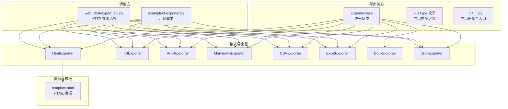
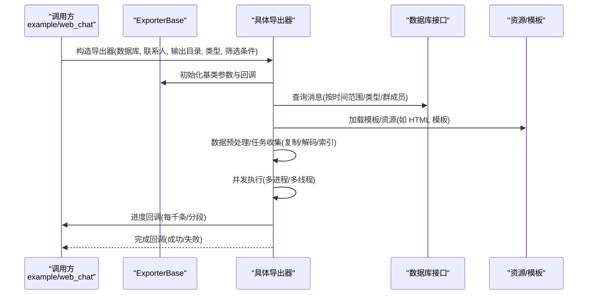
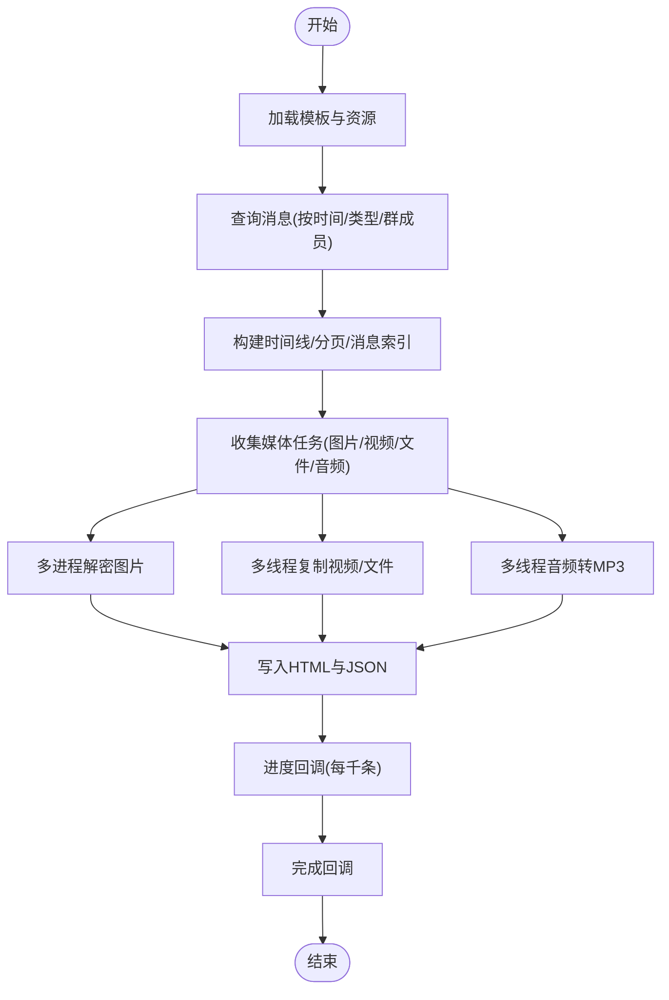
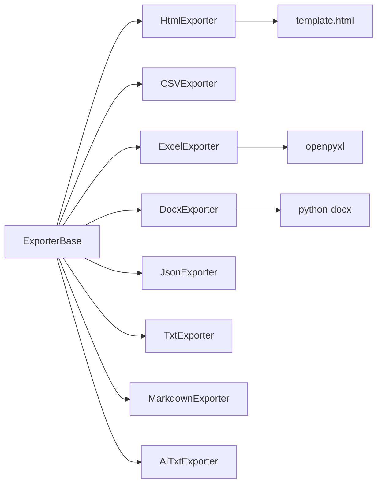

# 数据导出

<cite>
**本文引用的文件**
- [exporter/__init__.py](file://exporter/__init__.py)
- [exporter/config.py](file://exporter/config.py)
- [exporter/exporter.py](file://exporter/exporter.py)
- [exporter/exporter_html.py](file://exporter/exporter_html.py)
- [exporter/exporter_csv.py](file://exporter/exporter_csv.py)
- [exporter/exporter_docx.py](file://exporter/exporter_docx.py)
- [exporter/exporter_xlsx.py](file://exporter/exporter_xlsx.py)
- [exporter/exporter_json.py](file://exporter/exporter_json.py)
- [exporter/exporter_txt.py](file://exporter/exporter_txt.py)
- [exporter/exporter_markdown.py](file://exporter/exporter_markdown.py)
- [exporter/exporter_ai_txt.py](file://exporter/exporter_ai_txt.py)
- [exporter/resources/template.html](file://exporter/resources/template.html)
- [example/3-exporter.py](file://example/3-exporter.py)
- [web_chat/export_api.py](file://web_chat/export_api.py)
</cite>

## 目录
1. [简介](#简介)
2. [项目结构](#项目结构)
3. [核心组件](#核心组件)
4. [架构总览](#架构总览)
5. [详细组件分析](#详细组件分析)
6. [依赖分析](#依赖分析)
7. [性能考虑](#性能考虑)
8. [故障排查指南](#故障排查指南)
9. [结论](#结论)
10. [附录](#附录)

## 简介
本文件面向“数据导出”功能，系统性梳理 MemoTrace 中支持的导出格式（HTML、TXT、CSV、DOCX、XLSX、JSON、Markdown、AI 训练文本等），阐述导出配置体系（消息类型过滤、时间范围、群成员筛选、进度与完成回调）、批量导出机制（并发处理、进度跟踪、错误恢复），并深入解析各格式的实现原理（HTML 聊天界面还原、Excel 表格结构与图片嵌入、Word 文档排版、JSON 对话结构与训练数据切分）。同时给出性能优化策略、内存管理与大文件处理建议，以及自定义导出格式的开发指南与最佳实践。

## 项目结构
导出子系统位于 exporter 包，围绕统一基类与具体格式导出器展开；web_chat 提供导出 API；example 展示如何调用导出器进行单次或批量导出。

图表来源
- [exporter/exporter.py:82-177](file://exporter/exporter.py#L82-L177)
- [exporter/config.py:4-31](file://exporter/config.py#L4-L31)
- [exporter/__init__.py:1-8](file://exporter/__init__.py#L1-L8)
- [exporter/resources/template.html:1-800](file://exporter/resources/template.html#L1-L800)
- [example/3-exporter.py:31-135](file://example/3-exporter.py#L31-L135)
- [web_chat/export_api.py:63-76](file://web_chat/export_api.py#L63-L76)

章节来源
- [exporter/__init__.py:1-8](file://exporter/__init__.py#L1-L8)
- [exporter/config.py:4-31](file://exporter/config.py#L4-L31)
- [exporter/exporter.py:82-177](file://exporter/exporter.py#L82-L177)
- [exporter/resources/template.html:1-800](file://exporter/resources/template.html#L1-L800)
- [example/3-exporter.py:31-135](file://example/3-exporter.py#L31-L135)
- [web_chat/export_api.py:63-76](file://web_chat/export_api.py#L63-L76)

## 核心组件
- 统一基类与通用能力
  - 进度回调与完成回调、暂停/恢复/取消控制、消息筛选（按类型、群成员）、头像保存与路径解析、时间戳分段（5 分钟）等。
- 文件类型枚举
  - FileType 定义了 CSV、DOCX、HTML、TXT、JSON、PDF、公众号/朋友圈/视频号专用、媒体全量导出、AI 训练文本等类型常量。
- 导出器聚合入口
  - __init__.py 汇聚各导出器，便于按需导入与批量使用。

章节来源
- [exporter/exporter.py:82-177](file://exporter/exporter.py#L82-L177)
- [exporter/config.py:4-31](file://exporter/config.py#L4-L31)
- [exporter/__init__.py:1-8](file://exporter/__init__.py#L1-L8)

## 架构总览
导出流程从调用方发起，经由导出器基类与具体格式实现，结合数据库接口与资源文件（如 HTML 模板、图片解密、音频转码），最终生成目标格式文件并输出到指定目录。

图表来源
- [exporter/exporter.py:82-177](file://exporter/exporter.py#L82-L177)
- [exporter/exporter_html.py:26-298](file://exporter/exporter_html.py#L26-L298)
- [exporter/exporter_xlsx.py:103-306](file://exporter/exporter_xlsx.py#L103-L306)
- [exporter/exporter_docx.py:274-337](file://exporter/exporter_docx.py#L274-L337)
- [exporter/resources/template.html:1-800](file://exporter/resources/template.html#L1-L800)

## 详细组件分析

### HTML 导出器（HtmlExporter）
- 功能要点
  - 复制模板与表情资源至输出目录，注入联系人头像路径与上下文信息。
  - 遍历消息，构建时间轴与分页索引，统计各类消息索引（图片、文件、链接、音乐、转账、小程序、视频号等）。
  - 收集媒体复制与解码任务（图片多进程解密、视频/文件复制、音频转 MP3），完成后写入 HTML 与 JSON。
  - 进度回调按千条消息上报，完成时触发完成回调。
- 实现原理
  - 使用模板文件进行 HTML 页面骨架拼装，动态注入时间线、分页、消息索引与 JSON 数据。
  - 对图片采用多进程批量解密，对视频/文件采用多线程复制，对音频采用多线程转码。
- 适用场景
  - 需要在浏览器中查看聊天记录、保留时间线与消息分类索引的场景。

图表来源
- [exporter/exporter_html.py:26-298](file://exporter/exporter_html.py#L26-L298)
- [exporter/resources/template.html:1-800](file://exporter/resources/template.html#L1-L800)

章节来源
- [exporter/exporter_html.py:26-298](file://exporter/exporter_html.py#L26-L298)
- [exporter/resources/template.html:1-800](file://exporter/resources/template.html#L1-L800)

### CSV 导出器（CSVExporter）
- 功能要点
  - 将消息转换为行数据，写入 UTF-8-SIG 编码的 CSV 文件。
  - 支持按消息类型与时间范围筛选，按千条上报进度。
- 适用场景
  - 需要与表格软件兼容、进行二次加工与统计分析的场景。

章节来源
- [exporter/exporter_csv.py:9-50](file://exporter/exporter_csv.py#L9-L50)

### DOCX 导出器（DocxExporter）
- 功能要点
  - 逐条处理消息类型，生成带头像与内容的表格，支持回复消息、链接卡片、系统消息等。
  - 控制每份文档的消息数量上限，避免单文件过大；对不可打印字符进行过滤。
  - 头像与图片均按需解码/插入，异常时降级处理。
- 适用场景
  - 需要 Word 文档格式、保留消息排版与头像的场景。

章节来源
- [exporter/exporter_docx.py:42-337](file://exporter/exporter_docx.py#L42-L337)

### XLSX 导出器（ExcelExporter）
- 功能要点
  - 生成“聊天记录”与“成员信息”两个工作表；支持公众号/体育/收藏/支付等专项导出。
  - 图片采用多进程解密，视频/文件复制，音频转码；在需要时将图片嵌入单元格并按高度缩放。
  - 对文本列设置为文本格式，避免数字格式异常。
- 适用场景
  - 需要 Excel 表格、可直接打开查看与分析的场景。

章节来源
- [exporter/exporter_xlsx.py:51-527](file://exporter/exporter_xlsx.py#L51-L527)

### JSON 导出器（JsonExporter）
- 功能要点
  - 支持多种切分策略：按时间跨度、相邻消息间隔、滑动窗口；可配置模型键名与训练集比例。
  - 将消息序列转换为对话格式（system/user/assistant），合并连续同角色消息，支持隐私信息脱敏。
  - 可按模型要求输出不同键名（如 Alpaca 或 ChatGLM3）。
- 适用场景
  - 适配大模型训练、对话数据集构建的场景。

章节来源
- [exporter/exporter_json.py:100-306](file://exporter/exporter_json.py#L100-L306)

### TXT 导出器（TxtExporter）
- 功能要点
  - 以“时间+发送人”为标题，逐条写入文本内容，按千条上报进度。
- 适用场景
  - 简洁文本格式、便于阅读与检索的场景。

章节来源
- [exporter/exporter_txt.py:9-38](file://exporter/exporter_txt.py#L9-L38)

### Markdown 导出器（MarkdownExporter）
- 功能要点
  - 按消息类型输出 Markdown 片段（文本、图片、语音、表情、文件、链接卡片、系统消息、引用等）。
  - 按年/月/日自动分节，Markdown 转义特殊字符。
- 适用场景
  - 需要 Markdown 格式、兼容多种编辑器与静态站点生成的场景。

章节来源
- [exporter/exporter_markdown.py:27-211](file://exporter/exporter_markdown.py#L27-L211)

### AI 训练文本导出器（AiTxtExporter）
- 功能要点
  - 按日期分组，同一发送人连续消息合并，去除隐私信息，便于模型训练。
- 适用场景
  - 生成高质量的对话训练语料。

章节来源
- [exporter/exporter_ai_txt.py:9-52](file://exporter/exporter_ai_txt.py#L9-L52)

## 依赖分析
- 统一基类与通用工具
  - ExporterBase 提供进度/完成回调、消息筛选、头像管理、时间分段等通用能力。
  - 工具函数：文件复制（多线程）、音频解码（多线程）、FFmpeg 调用、隐私信息脱敏、新文件名生成等。
- 格式导出器
  - HtmlExporter：依赖模板与表情资源、多进程图片解密、多线程复制与音频转码。
  - ExcelExporter：依赖 openpyxl、图片解密与嵌入、超链接设置。
  - DocxExporter：依赖 python-docx、图片解密、表格与段落样式。
  - 其他格式：CSV/JSON/TXT/Markdown/AI_TXT 基于 ExporterBase 与数据库接口。
- 调用方
  - 示例脚本与 Web API 均通过 FileType 枚举与导出器类进行统一调度。

图表来源
- [exporter/exporter.py:82-177](file://exporter/exporter.py#L82-L177)
- [exporter/exporter_html.py:24-48](file://exporter/exporter_html.py#L24-L48)
- [exporter/exporter_xlsx.py:103-119](file://exporter/exporter_xlsx.py#L103-L119)
- [exporter/exporter_docx.py:42-58](file://exporter/exporter_docx.py#L42-L58)
- [exporter/resources/template.html:1-800](file://exporter/resources/template.html#L1-L800)

章节来源
- [exporter/exporter.py:82-177](file://exporter/exporter.py#L82-L177)
- [exporter/exporter_html.py:24-48](file://exporter/exporter_html.py#L24-L48)
- [exporter/exporter_xlsx.py:103-119](file://exporter/exporter_xlsx.py#L103-L119)
- [exporter/exporter_docx.py:42-58](file://exporter/exporter_docx.py#L42-L58)
- [exporter/resources/template.html:1-800](file://exporter/resources/template.html#L1-L800)

## 性能考虑
- 并发策略
  - 图片解密：多进程批量处理，显著提升解密效率。
  - 文件复制与音频转码：多线程异步执行，避免阻塞主线程。
- 进度与内存
  - 每处理千条消息上报一次进度，避免频繁 IO；部分格式（如 CSV/JSON）采用累积缓冲写入。
  - Excel 图片嵌入时按高度缩放并设置行高，避免单元格过大影响渲染。
- 大文件与稳定性
  - Docx 分段保存（按消息数量上限），降低单文件体积与内存占用。
  - 导出器基类提供暂停/恢复/取消控制，便于长时间任务的中断与恢复。
- I/O 与磁盘
  - 输出目录按媒体类型建立子目录，减少根目录文件数量；新文件名冲突检测与重命名。

章节来源
- [exporter/exporter_html.py:240-247](file://exporter/exporter_html.py#L240-L247)
- [exporter/exporter_xlsx.py:247-292](file://exporter/exporter_xlsx.py#L247-L292)
- [exporter/exporter_docx.py:294-334](file://exporter/exporter_docx.py#L294-L334)
- [exporter/exporter.py:511-527](file://exporter/exporter.py#L511-L527)

## 故障排查指南
- 常见问题
  - 权限错误：导出文件被占用或权限不足，导出器会捕获并回退到带时间戳的新文件名。
  - 依赖缺失：DOCX 导出需要 python-docx，若未安装则导出器不可用。
  - 图片/音频异常：部分图片元数据异常导致插入失败，代码中有降级处理与日志记录。
  - Excel 图片嵌入失败：尝试按已知扩展名匹配并缩放，失败则跳过。
- 排查步骤
  - 检查导出器可用性与错误信息（Web API 提供 exporter_available 与 exporter_error）。
  - 查看日志输出与异常堆栈，定位具体阶段（查询、复制、解码、保存）。
  - 减少并发或限制消息数量，验证是否为资源瓶颈或内存不足导致的问题。

章节来源
- [web_chat/export_api.py:201-223](file://web_chat/export_api.py#L201-L223)
- [exporter/exporter_docx.py:104-113](file://exporter/exporter_docx.py#L104-L113)
- [exporter/exporter_xlsx.py:265-292](file://exporter/exporter_xlsx.py#L265-L292)
- [exporter/exporter.py:511-527](file://exporter/exporter.py#L511-L527)

## 结论
MemoTrace 的数据导出体系以统一基类为核心，围绕多种格式导出器提供灵活配置与高效实现。通过并发处理、进度回调与错误恢复机制，满足从个人阅读到大规模分析与训练的多样化需求。建议在生产环境中优先采用 HTML/XLSX/CSV 等通用格式，必要时使用 DOCX/Mardown 以满足排版与可读性要求；对大体量数据采用分段保存与并发策略，确保稳定与性能。

## 附录

### 导出配置系统设计
- 消息类型筛选
  - 通过消息类型集合控制导出范围（文本、图片、语音、视频、链接、小程序、系统消息等）。
- 时间范围
  - 支持固定范围或按月/季度/自定义时间区间。
- 群成员筛选
  - 在群聊场景下仅导出指定成员的消息。
- 进度与完成回调
  - 支持自定义进度回调与完成回调，便于集成 UI 与任务管理。
- 模板与样式
  - HTML 使用模板文件，可扩展样式与交互；DOCX/Excel 可按需调整样式与布局。

章节来源
- [exporter/exporter.py:85-136](file://exporter/exporter.py#L85-L136)
- [web_chat/export_api.py:164-198](file://web_chat/export_api.py#L164-L198)

### 批量导出机制
- 并发处理
  - 图片解密使用多进程；文件复制与音频转码使用多线程；Docx 分段保存。
- 进度跟踪
  - 每处理一定数量的消息上报进度，最终完成回调。
- 错误恢复
  - 导出器基类提供暂停/恢复/取消控制；文件写入捕获异常并回退到安全文件名。

章节来源
- [exporter/exporter_html.py:240-247](file://exporter/exporter_html.py#L240-L247)
- [exporter/exporter_xlsx.py:250-253](file://exporter/exporter_xlsx.py#L250-L253)
- [exporter/exporter_docx.py:324-334](file://exporter/exporter_docx.py#L324-L334)
- [exporter/exporter.py:68-80](file://exporter/exporter.py#L68-L80)

### 各导出格式实现原理
- HTML
  - 模板拼接 + 时间线/分页索引 + JSON 数据；媒体资源复制与转码。
- Excel
  - 多工作表、超链接、图片嵌入、文本列格式化。
- Word
  - 表格与段落样式、头像与图片插入、分段保存。
- CSV/JSON/TXT/Markdown/AI_TXT
  - 结构化数据写入、隐私信息脱敏、按类型/日期分组。

章节来源
- [exporter/exporter_html.py:26-298](file://exporter/exporter_html.py#L26-L298)
- [exporter/exporter_xlsx.py:103-306](file://exporter/exporter_xlsx.py#L103-L306)
- [exporter/exporter_docx.py:274-337](file://exporter/exporter_docx.py#L274-L337)
- [exporter/exporter_csv.py:26-49](file://exporter/exporter_csv.py#L26-L49)
- [exporter/exporter_json.py:265-305](file://exporter/exporter_json.py#L265-L305)
- [exporter/exporter_txt.py:17-37](file://exporter/exporter_txt.py#L17-L37)
- [exporter/exporter_markdown.py:138-211](file://exporter/exporter_markdown.py#L138-L211)
- [exporter/exporter_ai_txt.py:20-51](file://exporter/exporter_ai_txt.py#L20-L51)

### 自定义导出格式开发指南与最佳实践
- 开发步骤
  - 继承 ExporterBase，实现 export 方法；在构造函数中接收数据库、联系人、输出目录、类型、筛选条件与回调。
  - 在 export 中完成消息查询、数据预处理、任务收集（复制/解码/索引）、并发执行与文件写入。
  - 按千条消息上报进度，最后触发完成回调。
- 最佳实践
  - 明确输出目录结构与文件命名规范，避免覆盖与冲突。
  - 对媒体资源采用并发处理，合理设置并发度。
  - 对异常进行捕获与降级，保证导出过程稳健。
  - 对隐私信息进行脱敏处理，遵守数据保护要求。
  - 对大文件采用分段保存或流式写入，控制内存峰值。

章节来源
- [exporter/exporter.py:82-177](file://exporter/exporter.py#L82-L177)
- [exporter/exporter.py:511-527](file://exporter/exporter.py#L511-L527)
- [exporter/exporter_json.py:140-165](file://exporter/exporter_json.py#L140-L165)