# 数据库管理

<cite>
**本文引用的文件**   
- [db_main.py](file://wxManager/db_main.py)
- [manager_v3.py](file://wxManager/manager_v3.py)
- [manager_v4.py](file://wxManager/manager_v4.py)
- [decrypt_v3.py](file://wxManager/decrypt/decrypt_v3.py)
- [decrypt_v4.py](file://wxManager/decrypt/decrypt_v4.py)
- [msg.py](file://wxManager/db_v3/msg.py)
- [media_msg.py](file://wxManager/db_v3/media_msg.py)
- [message.py](file://wxManager/db_v4/message.py)
- [media.py](file://wxManager/db_v4/media.py)
- [wechat_v3.py](file://wxManager/parser/wechat_v3.py)
- [wechat_v4.py](file://wxManager/parser/wechat_v4.py)
- [db_model.py](file://wxManager/model/db_model.py)
- [contact.py](file://wxManager/model/contact.py)
- [merge.py](file://wxManager/merge.py)
</cite>

## 目录
1. [简介](#简介)
2. [项目结构](#项目结构)
3. [核心组件](#核心组件)
4. [架构总览](#架构总览)
5. [详细组件分析](#详细组件分析)
6. [依赖分析](#依赖分析)
7. [性能考量](#性能考量)
8. [故障排除指南](#故障排除指南)
9. [结论](#结论)
10. [附录](#附录)

## 简介
本文件面向微信数据库管理模块，系统性阐述微信V3/V4数据库的结构差异与解密机制，覆盖加密算法、数据表结构、字段含义、数据库连接与读取流程、解密过程、错误处理、接口设计模式（抽象基类、具体实现类、工厂模式）、配置与性能优化、多媒体文件关联与缓存策略等。旨在帮助开发者快速理解并高效使用该模块进行数据读取、解析与导出。

## 项目结构
- 接口与上下文
  - 抽象接口：DataBaseInterface 定义统一数据库能力集合
  - 上下文封装：Context 将具体实现动态绑定到调用方
- 版本适配
  - V3：manager_v3.DataBaseV3 聚合多子库（消息、媒体、表情、硬链等）
  - V4：manager_v4.DataBaseV4 聚合多子库（联系人、会话、消息、媒体、硬链等）
- 数据库模型基类
  - model.db_model.DataBaseBase 统一封装SQLite连接、游标、事务、系列数据库（MSG0/MSG1…）支持
- 解密模块
  - decrypt_v3.py：V3数据库AES-CBC解密（PBKDF2-HMAC-SHA1派生密钥与HMAC校验）
  - decrypt_v4.py：V4数据库AES-256-CBC解密（PBKDF2-HMAC-SHA512派生密钥与HMAC校验）
- 解析器
  - parser.wechat_v3/wechat_v4：基于工厂模式的消息类型解析器，负责将原始消息解析为统一的Message对象
- 媒体与文件
  - db_v3.media_msg 与 db_v4.media：媒体缓冲读取、音频转MP3、语音识别文本
- 合并工具
  - merge.py：增量合并与去重更新，保障多版本数据库一致性

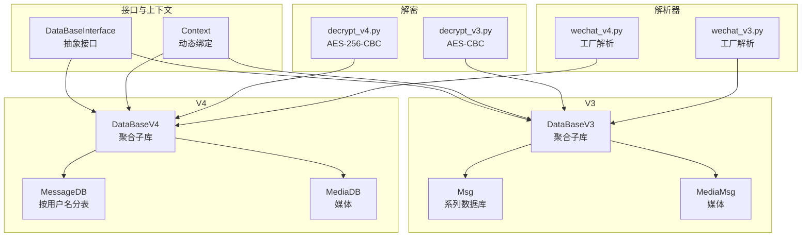

图表来源
- [db_main.py:22-251](file://wxManager/db_main.py#L22-L251)
- [manager_v3.py:173-699](file://wxManager/manager_v3.py#L173-L699)
- [manager_v4.py:71-485](file://wxManager/manager_v4.py#L71-L485)
- [decrypt_v3.py:34-121](file://wxManager/decrypt/decrypt_v3.py#L34-L121)
- [decrypt_v4.py:21-138](file://wxManager/decrypt/decrypt_v4.py#L21-L138)
- [wechat_v3.py:63-800](file://wxManager/parser/wechat_v3.py#L63-L800)
- [wechat_v4.py:84-800](file://wxManager/parser/wechat_v4.py#L84-L800)

章节来源
- [db_main.py:22-251](file://wxManager/db_main.py#L22-L251)
- [manager_v3.py:173-699](file://wxManager/manager_v3.py#L173-L699)
- [manager_v4.py:71-485](file://wxManager/manager_v4.py#L71-L485)

## 核心组件
- 抽象接口与上下文
  - DataBaseInterface：定义统一的数据库能力，如会话、消息查询、按类型过滤、按关键字检索、联系人、头像、表情、图片/视频/文件、语音、收藏等
  - Context：将具体实现的所有公开方法动态绑定到调用侧，屏蔽实现细节
- V3实现（DataBaseV3）
  - 聚合子库：Misc、Msg（系列）、PublicMsg、MicroMsg、HardLinkImage/Video/File、Emotion、MediaMSG、OpenIMContact/Media/Msg、Audio2Text
  - 并行处理：批量消息读取时采用多进程池拆分批处理，提升吞吐
- V4实现（DataBaseV4）
  - 聚合子库：contact/contact.db、head_image/head_image.db、session/session.db、message/message_0.db（系列）、message/biz_message_0.db（系列）、message/media_0.db（系列）、hardlink/hardlink.db、emoticon/emoticon.db、Audio2Text
  - 并行处理：同V3，批量消息读取采用多进程池
- 数据库基类（DataBaseBase）
  - 统一连接、游标、事务、系列数据库（MSG0/MSG1…）枚举与连接
  - 提供commit、execute、close、merge等通用能力
- 解密模块
  - V3：PBKDF2-HMAC-SHA1派生密钥与HMAC校验，逐页解密
  - V4：PBKDF2-HMAC-SHA512派生密钥与HMAC校验，逐页解密
- 解析器（工厂模式）
  - V3：基于类型/子类型映射，工厂创建对应消息对象（文本、图片、语音、视频、链接、小程序、音乐、转账、红包、合并消息、位置、引用、系统消息等）
  - V4：基于zstd解压与protobuf解析，工厂创建对应消息对象
- 媒体与文件
  - V3：MediaMSG表读取媒体缓冲，silk转PCM再转MP3；语音识别文本落库
  - V4：VoiceInfo表读取媒体缓冲，silk转PCM再转MP3；支持按server_id检索
- 合并工具
  - 增量合并与去重更新，保障多版本数据库一致性

章节来源
- [db_main.py:22-251](file://wxManager/db_main.py#L22-L251)
- [manager_v3.py:173-699](file://wxManager/manager_v3.py#L173-L699)
- [manager_v4.py:71-485](file://wxManager/manager_v4.py#L71-L485)
- [db_model.py:16-94](file://wxManager/model/db_model.py#L16-L94)
- [decrypt_v3.py:34-121](file://wxManager/decrypt/decrypt_v3.py#L34-L121)
- [decrypt_v4.py:21-138](file://wxManager/decrypt/decrypt_v4.py#L21-L138)
- [wechat_v3.py:63-800](file://wxManager/parser/wechat_v3.py#L63-L800)
- [wechat_v4.py:84-800](file://wxManager/parser/wechat_v4.py#L84-L800)
- [media_msg.py:26-282](file://wxManager/db_v3/media_msg.py#L26-L282)
- [media.py:32-123](file://wxManager/db_v4/media.py#L32-L123)
- [merge.py:22-183](file://wxManager/merge.py#L22-L183)

## 架构总览
微信数据库管理模块采用“接口抽象 + 具体实现 + 工厂解析 + 媒体处理 + 解密”的分层架构。V3与V4分别对应不同版本数据库的组织方式与字段结构，但通过统一接口与解析器实现一致的消息对象模型，便于上层业务统一处理。

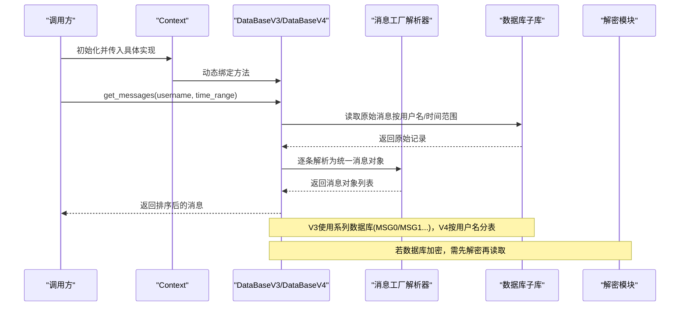

图表来源
- [db_main.py:236-251](file://wxManager/db_main.py#L236-L251)
- [manager_v3.py:244-314](file://wxManager/manager_v3.py#L244-L314)
- [manager_v4.py:120-174](file://wxManager/manager_v4.py#L120-L174)
- [wechat_v3.py:40-61](file://wxManager/parser/wechat_v3.py#L40-L61)
- [wechat_v4.py:44-51](file://wxManager/parser/wechat_v4.py#L44-L51)
- [decrypt_v3.py:34-86](file://wxManager/decrypt/decrypt_v3.py#L34-L86)
- [decrypt_v4.py:21-103](file://wxManager/decrypt/decrypt_v4.py#L21-L103)

## 详细组件分析

### 抽象接口与上下文
- 抽象接口 DataBaseInterface 定义统一能力集，包括会话、消息查询（按时间、数量、类型、关键词、小时/日/月统计）、联系人、头像、表情、图片/视频/文件、语音、收藏等
- Context 将具体实现的所有公开方法动态绑定到调用侧，避免直接耦合具体实现类

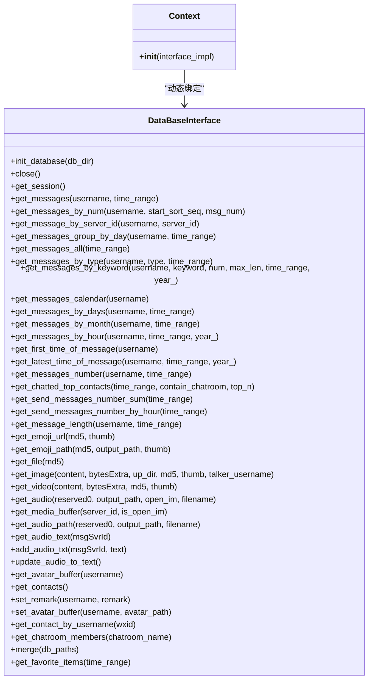

图表来源
- [db_main.py:22-251](file://wxManager/db_main.py#L22-L251)

章节来源
- [db_main.py:22-251](file://wxManager/db_main.py#L22-L251)

### V3数据库实现（DataBaseV3）
- 子库聚合
  - Misc、Msg（系列）、PublicMsg、MicroMsg、HardLinkImage/Video/File、Emotion、MediaMSG、OpenIMContact/Media/Msg、Audio2Text
- 并行处理
  - 大批量消息读取时，将消息批次拆分为多个子批次，使用多进程池并行解析，显著提升吞吐
- 联系人与群成员
  - 通过MicroMsg与OpenIMContact解析联系人详情，群成员通过protobuf RoomData解析
- 媒体与语音
  - 通过MediaMSG读取媒体缓冲，silk转PCM再转MP3；语音识别文本落库

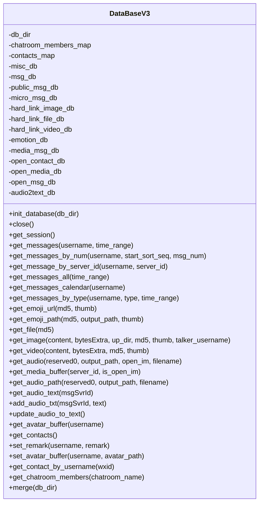

图表来源
- [manager_v3.py:173-699](file://wxManager/manager_v3.py#L173-L699)

章节来源
- [manager_v3.py:173-699](file://wxManager/manager_v3.py#L173-L699)

### V4数据库实现（DataBaseV4）
- 子库聚合
  - contact/contact.db、head_image/head_image.db、session/session.db、message/message_0.db（系列）、message/biz_message_0.db（系列）、message/media_0.db（系列）、hardlink/hardlink.db、emoticon/emoticon.db、Audio2Text
- 并行处理
  - 同V3，批量消息读取采用多进程池
- 联系人与群成员
  - 通过ContactDB与OpenIM解析联系人详情，群成员通过protobuf RoomData解析
- 媒体与语音
  - 通过MediaDB读取VoiceInfo媒体缓冲，silk转PCM再转MP3；语音识别文本落库

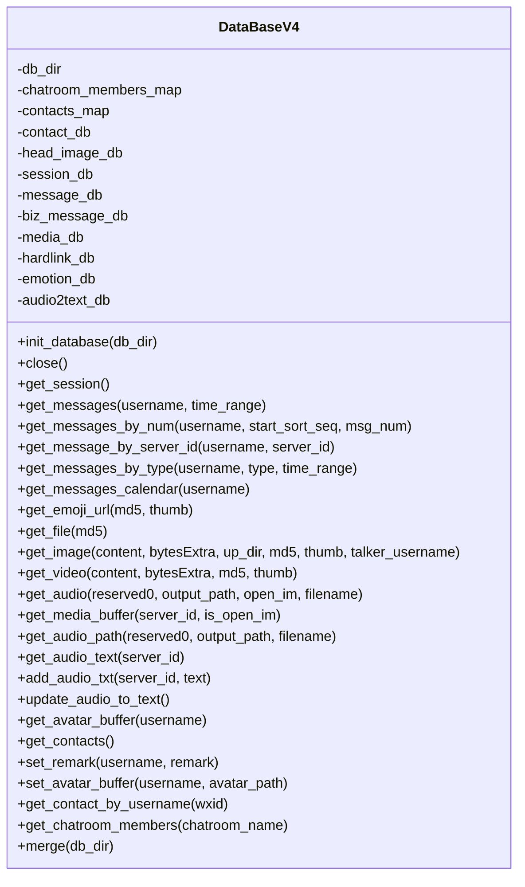

图表来源
- [manager_v4.py:71-485](file://wxManager/manager_v4.py#L71-L485)

章节来源
- [manager_v4.py:71-485](file://wxManager/manager_v4.py#L71-L485)

### 数据库基类（DataBaseBase）
- 统一连接与游标管理
  - 支持单库与系列数据库（MSG0/MSG1…）自动枚举与连接
  - 提供commit、execute、close、merge等通用能力
- 系列数据库处理
  - 自动扫描目录下的MSG0/MSG1…文件，建立多连接与游标，便于并行查询

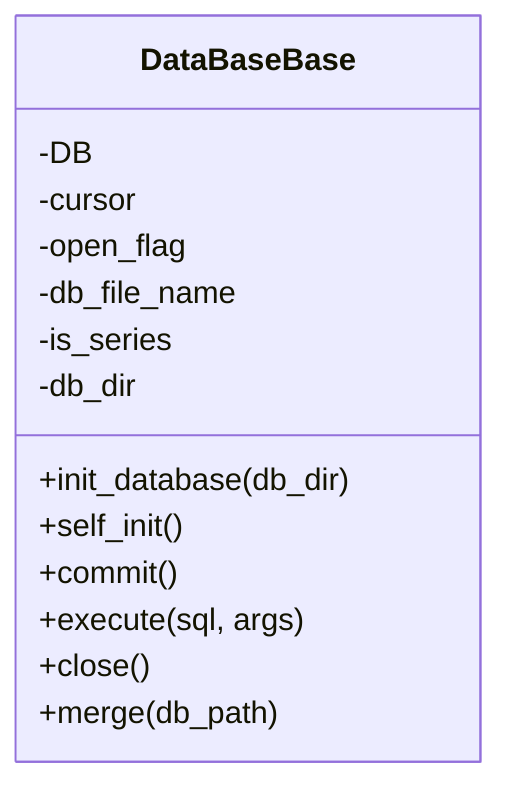

图表来源
- [db_model.py:16-94](file://wxManager/model/db_model.py#L16-L94)

章节来源
- [db_model.py:16-94](file://wxManager/model/db_model.py#L16-L94)

### 解密机制（V3/V4）
- V3解密（decrypt_v3.py）
  - 算法：AES-CBC
  - 密钥派生：PBKDF2-HMAC-SHA1，迭代64000次
  - HMAC校验：SHA1，迭代2次
  - 页面结构：首页4096字节（含16字节盐），后续页4096字节，页尾包含IV与HMAC
- V4解密（decrypt_v4.py）
  - 算法：AES-256-CBC
  - 密钥派生：PBKDF2-HMAC-SHA512，迭代256000次
  - HMAC校验：SHA512
  - 页面结构：首页含盐，后续页含保留区（IV+HMAC），按AES块大小对齐

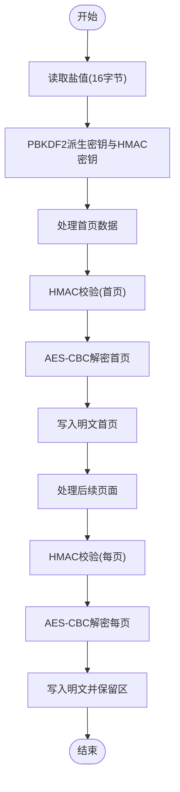

图表来源
- [decrypt_v3.py:34-86](file://wxManager/decrypt/decrypt_v3.py#L34-L86)
- [decrypt_v4.py:21-103](file://wxManager/decrypt/decrypt_v4.py#L21-L103)

章节来源
- [decrypt_v3.py:34-121](file://wxManager/decrypt/decrypt_v3.py#L34-L121)
- [decrypt_v4.py:21-138](file://wxManager/decrypt/decrypt_v4.py#L21-L138)

### 消息解析（工厂模式）
- V3（wechat_v3.py）
  - 类型映射：(type, subtype) → MessageType
  - 工厂注册表：FACTORY_REGISTRY，按消息类型创建对应工厂
  - 单例缓存：Singleton缓存联系人与消息，减少重复查询
- V4（wechat_v4.py）
  - 解压：zstd解压压缩内容
  - Protobuf：解析packed_info_data等结构
  - 工厂注册表：FACTORY_REGISTRY，按消息类型创建对应工厂
  - 单例缓存：LimitedDict缓存最近消息，控制内存占用

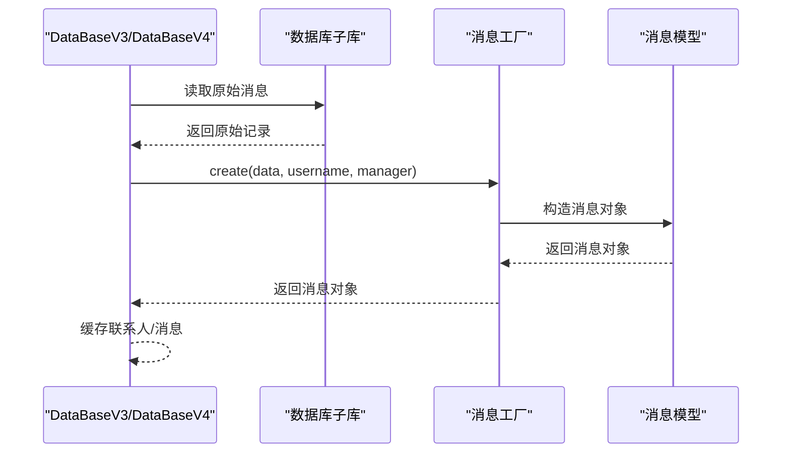

图表来源
- [wechat_v3.py:63-200](file://wxManager/parser/wechat_v3.py#L63-L200)
- [wechat_v4.py:84-205](file://wxManager/parser/wechat_v4.py#L84-L205)

章节来源
- [wechat_v3.py:63-800](file://wxManager/parser/wechat_v3.py#L63-L800)
- [wechat_v4.py:84-800](file://wxManager/parser/wechat_v4.py#L84-L800)

### 媒体与文件处理
- V3（db_v3.media_msg.py）
  - 读取Media表缓冲，silk转PCM再转MP3
  - 语音识别文本解析与落库
- V4（db_v4.media.py）
  - 读取VoiceInfo表缓冲，silk转PCM再转MP3
  - 支持按server_id检索

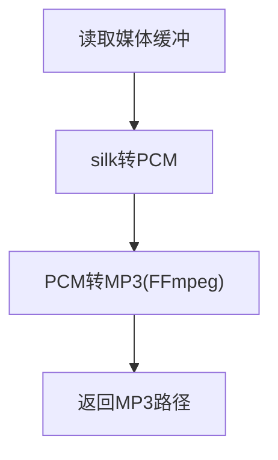

图表来源
- [media_msg.py:29-94](file://wxManager/db_v3/media_msg.py#L29-L94)
- [media.py:33-99](file://wxManager/db_v4/media.py#L33-L99)

章节来源
- [media_msg.py:26-282](file://wxManager/db_v3/media_msg.py#L26-L282)
- [media.py:32-123](file://wxManager/db_v4/media.py#L32-L123)

### 数据库连接与读取流程
- V3
  - 通过Msg（系列）数据库按用户名/时间范围查询，支持按数量、类型、关键词、日历等维度查询
  - 大批量读取时拆分批次并行解析
- V4
  - 通过按用户名哈希生成的表（Msg_<hash>)查询，支持按server_id、类型、时间范围等查询
  - 大批量读取时拆分批次并行解析

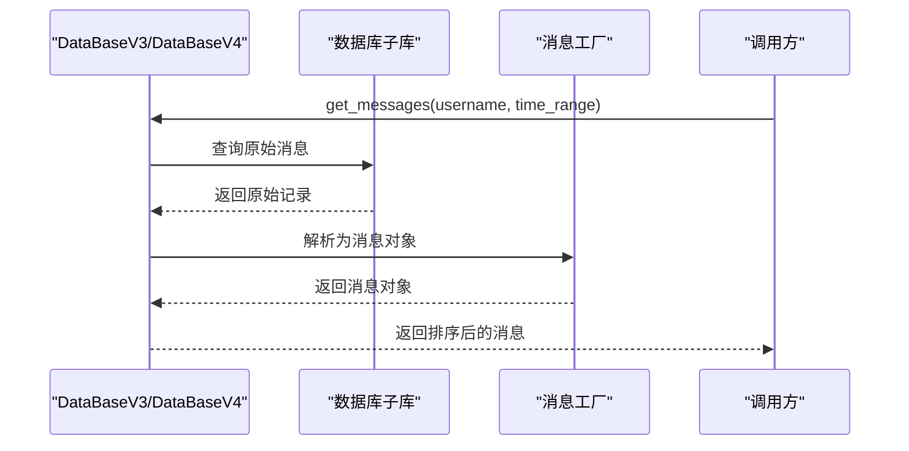

图表来源
- [msg.py:151-168](file://wxManager/db_v3/msg.py#L151-L168)
- [message.py:102-119](file://wxManager/db_v4/message.py#L102-L119)
- [wechat_v3.py:144-170](file://wxManager/parser/wechat_v3.py#L144-L170)
- [wechat_v4.py:131-155](file://wxManager/parser/wechat_v4.py#L131-L155)

章节来源
- [msg.py:91-302](file://wxManager/db_v3/msg.py#L91-L302)
- [message.py:65-323](file://wxManager/db_v4/message.py#L65-L323)

### 联系人与群成员
- V3
  - 通过MicroMsg与OpenIMContact解析联系人详情，群成员通过protobuf RoomData解析
- V4
  - 通过ContactDB与OpenIM解析联系人详情，群成员通过protobuf RoomData解析

章节来源
- [manager_v3.py:472-660](file://wxManager/manager_v3.py#L472-L660)
- [manager_v4.py:297-445](file://wxManager/manager_v4.py#L297-L445)

### 增量合并与去重更新
- 增量合并：将新数据库中的数据按列去重后插入目标库
- 去重更新：若冲突则删除旧数据并更新

章节来源
- [merge.py:22-183](file://wxManager/merge.py#L22-L183)

## 依赖分析
- 组件耦合
  - 实现类依赖于各子库模块（Msg/Media/Contact等）
  - 解析器依赖于数据库接口与消息模型
  - 解密模块独立于实现类，可前置解密后复用
- 外部依赖
  - 第三方库：Crypto（AES/HMAC）、zstd（V4解压）、protobuf（RoomData/packed_info_data）
- 循环依赖
  - 未发现循环依赖，接口与实现分离清晰

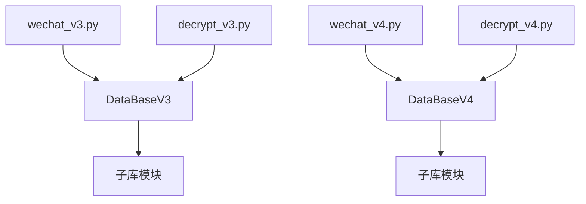

图表来源
- [manager_v3.py:173-699](file://wxManager/manager_v3.py#L173-L699)
- [manager_v4.py:71-485](file://wxManager/manager_v4.py#L71-L485)
- [wechat_v3.py:63-800](file://wxManager/parser/wechat_v3.py#L63-L800)
- [wechat_v4.py:84-800](file://wxManager/parser/wechat_v4.py#L84-L800)
- [decrypt_v3.py:34-121](file://wxManager/decrypt/decrypt_v3.py#L34-L121)
- [decrypt_v4.py:21-138](file://wxManager/decrypt/decrypt_v4.py#L21-L138)

章节来源
- [manager_v3.py:173-699](file://wxManager/manager_v3.py#L173-L699)
- [manager_v4.py:71-485](file://wxManager/manager_v4.py#L71-L485)

## 性能考量
- 并行化
  - 批量消息读取采用多进程池拆分批次，显著提升吞吐
- 缓存
  - V3：Singleton缓存联系人与消息
  - V4：LimitedDict缓存最近消息，控制内存占用
- 数据库连接
  - 系列数据库（MSG0/MSG1…）自动枚举与连接，减少重复打开
- I/O优化
  - 媒体文件通过硬链接或本地路径直接访问，避免重复拷贝

章节来源
- [manager_v3.py:276-314](file://wxManager/manager_v3.py#L276-L314)
- [manager_v4.py:137-174](file://wxManager/manager_v4.py#L137-L174)
- [wechat_v3.py:77-107](file://wxManager/parser/wechat_v3.py#L77-L107)
- [wechat_v4.py:53-82](file://wxManager/parser/wechat_v4.py#L53-L82)
- [db_model.py:33-54](file://wxManager/model/db_model.py#L33-L54)

## 故障排除指南
- 解密失败
  - 检查密钥长度与格式（V3为64位十六进制字符串；V4为十六进制密钥）
  - 确认盐值与HMAC校验通过
- 数据库连接失败
  - 确认数据库路径存在且可读
  - 系列数据库（MSG0/MSG1…）需确保文件连续存在
- 消息解析异常
  - 检查压缩内容是否正确解压（V4使用zstd）
  - 检查protobuf结构是否匹配（RoomData/packed_info_data）
- 媒体文件缺失
  - 检查硬链接或本地路径是否存在
  - 确认FFmpeg路径与权限

章节来源
- [decrypt_v3.py:34-86](file://wxManager/decrypt/decrypt_v3.py#L34-L86)
- [decrypt_v4.py:21-103](file://wxManager/decrypt/decrypt_v4.py#L21-L103)
- [wechat_v4.py:44-51](file://wxManager/parser/wechat_v4.py#L44-L51)
- [media_msg.py:57-87](file://wxManager/db_v3/media_msg.py#L57-L87)
- [media.py:69-99](file://wxManager/db_v4/media.py#L69-L99)

## 结论
本模块通过统一接口与工厂解析，实现了对微信V3/V4数据库的跨版本兼容访问。结合并行化、缓存与增量合并策略，有效提升了性能与稳定性。解密模块独立于实现，便于在不同环境下灵活部署。建议在生产环境中优先使用解密后的数据库副本，并配合缓存与索引策略进一步优化查询性能。

## 附录
- 数据库配置选项
  - 数据库根目录：db_dir
  - 系列数据库：MSG0/MSG1…（V3）
  - 按用户名分表：Msg_<hash>（V4）
- 性能优化建议
  - 合理设置并行度，避免CPU/IO瓶颈
  - 使用缓存减少重复查询
  - 对高频查询建立索引（如server_id、MsgSvrID）
- 媒体文件关联与缓存
  - 通过硬链接或本地路径直接访问媒体文件
  - 使用Singleton/LimitedDict缓存消息与联系人