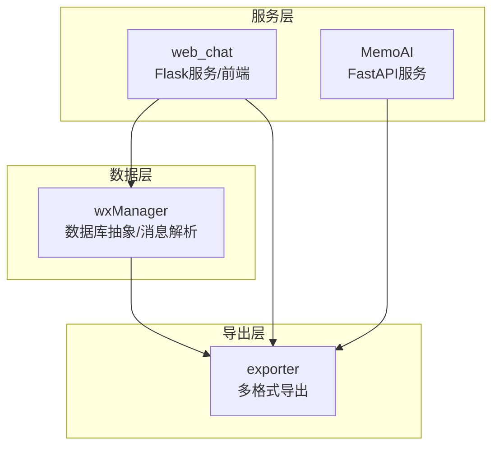
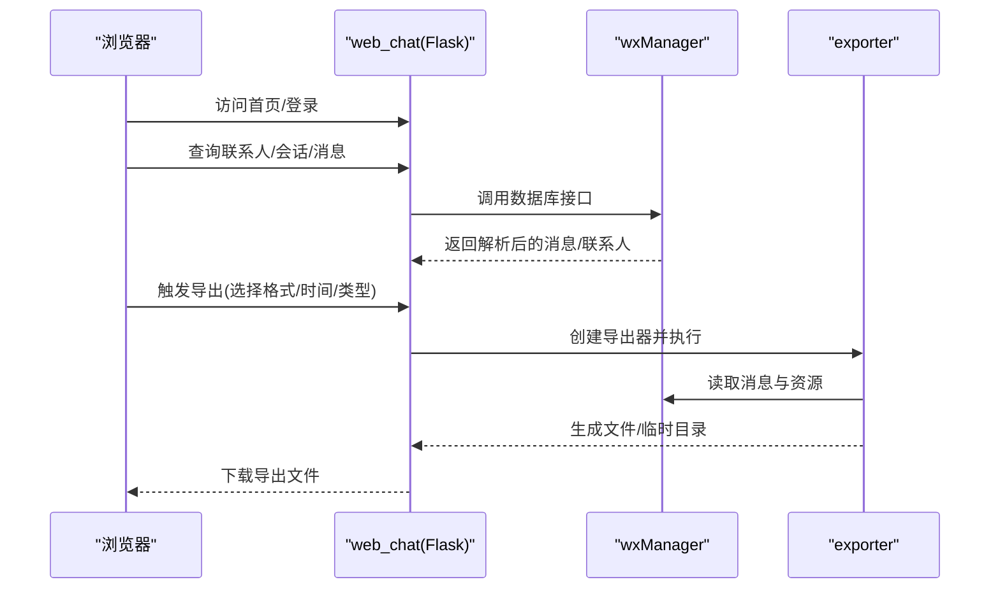
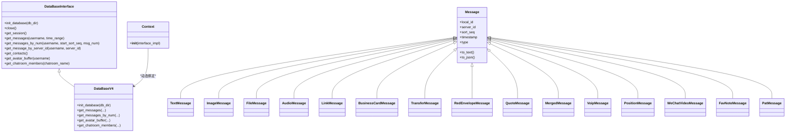
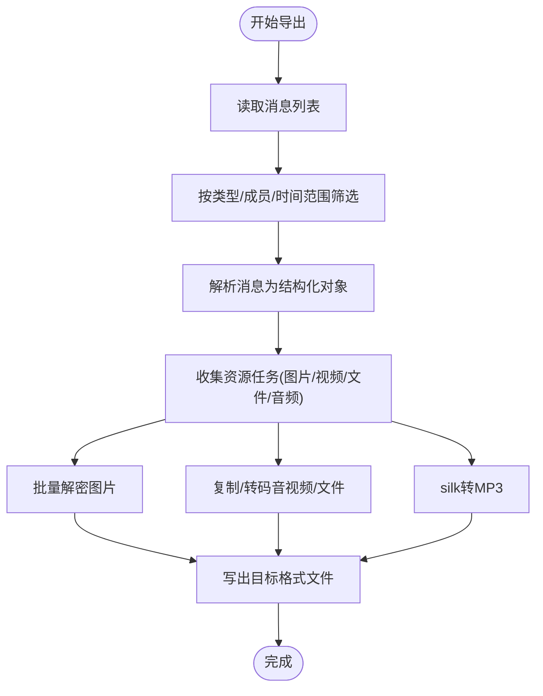
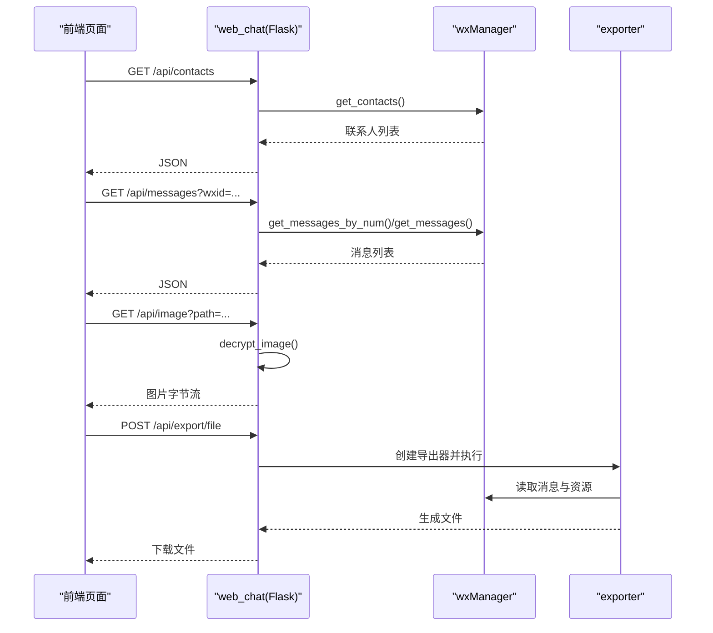
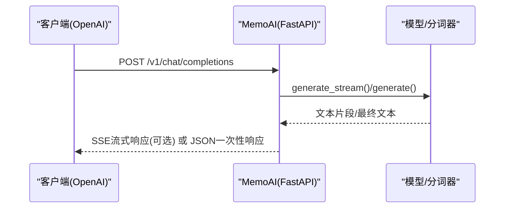
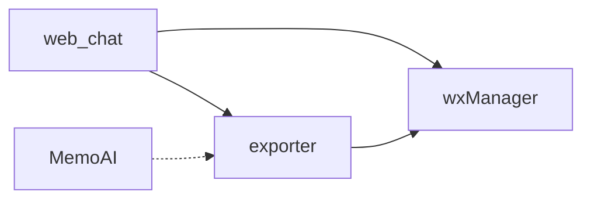

# 核心模块

<cite>
**本文引用的文件**
- [readme.md](file://readme.md)
- [wxManager/__init__.py](file://wxManager/__init__.py)
- [wxManager/db_main.py](file://wxManager/db_main.py)
- [wxManager/manager_v4.py](file://wxManager/manager_v4.py)
- [wxManager/model/message.py](file://wxManager/model/message.py)
- [exporter/__init__.py](file://exporter/__init__.py)
- [exporter/config.py](file://exporter/config.py)
- [exporter/exporter.py](file://exporter/exporter.py)
- [exporter/exporter_html.py](file://exporter/exporter_html.py)
- [exporter/exporter_ai_txt.py](file://exporter/exporter_ai_txt.py)
- [web_chat/app.py](file://web_chat/app.py)
- [web_chat/export_api.py](file://web_chat/export_api.py)
- [web_chat/static/index.html](file://web_chat/static/index.html)
- [MemoAI/api_server.py](file://MemoAI/api_server.py)
- [MemoAI/readme.md](file://MemoAI/readme.md)
</cite>

## 目录
1. [简介](#简介)
2. [项目结构](#项目结构)
3. [核心组件](#核心组件)
4. [架构总览](#架构总览)
5. [详细组件分析](#详细组件分析)
6. [依赖关系分析](#依赖关系分析)
7. [性能考量](#性能考量)
8. [故障排查指南](#故障排查指南)
9. [结论](#结论)
10. [附录](#附录)

## 简介
本文件面向MemoTrace的核心模块，系统化梳理微信数据库管理（wxManager）、数据导出（exporter）、Web聊天服务（web_chat）、AI聊天服务（MemoAI）四大模块的功能定位、架构设计与交互关系。重点说明：
- wxManager如何抽象数据库接口、解析消息类型、解密与读取多媒体资源；
- exporter如何按多格式导出聊天记录并组织资源文件；
- web_chat如何提供前端界面与API，对接wxManager与exporter；
- MemoAI如何提供OpenAI风格的API，支撑个人AI训练与部署。

## 项目结构
MemoTrace采用模块化分层设计：wxManager负责底层数据库抽象与消息解析；exporter提供多格式导出能力；web_chat提供Web界面与API；MemoAI提供大模型推理服务。模块间通过清晰的接口耦合，形成“数据源—解析—导出—展示/服务”的闭环。

图表来源
- [wxManager/db_main.py](file://wxManager/db_main.py)
- [exporter/exporter.py](file://exporter/exporter.py)
- [web_chat/app.py](file://web_chat/app.py)
- [MemoAI/api_server.py](file://MemoAI/api_server.py)

章节来源
- [readme.md](file://readme.md)
- [wxManager/__init__.py](file://wxManager/__init__.py)

## 核心组件
- wxManager（数据库与消息解析）
  - 抽象接口：DataBaseInterface定义统一数据库能力，Context动态绑定实现。
  - 版本适配：DataBaseV4整合多子库（联系人、会话、消息、媒体、硬链等），支持V4数据库。
  - 消息模型：Message及派生类（文本、图片、文件、语音、链接、小程序、视频号、合并转发、转账、红包、名片、拍一拍、系统消息等）。
  - 资源访问：头像、表情、图片、视频、音频、文件等资源的读取与解密。
- exporter（多格式导出）
  - 基类：ExporterBase封装导出流程、进度回调、头像保存、消息筛选等通用逻辑。
  - 格式：HTML、TXT、AI训练文本、Markdown、Excel、JSON、CSV、DOCX（可选）。
  - 资源处理：批量解密图片、复制/转码音视频、文件拷贝、隐私信息脱敏。
- web_chat（Web聊天服务）
  - Flask服务：提供联系人、会话、消息查询API；图片解密与头像获取；注册导出蓝图。
  - 前端：静态页面与交互逻辑，支持导出配置与触发。
- MemoAI（AI聊天服务）
  - FastAPI服务：提供OpenAI风格的/v1/chat/completions与/v1/models接口，支持流式输出与嵌入生成。
  - 部署：支持本地模型与微调模型加载，提供调用示例与部署指引。

章节来源
- [wxManager/db_main.py](file://wxManager/db_main.py)
- [wxManager/manager_v4.py](file://wxManager/manager_v4.py)
- [wxManager/model/message.py](file://wxManager/model/message.py)
- [exporter/exporter.py](file://exporter/exporter.py)
- [exporter/exporter_html.py](file://exporter/exporter_html.py)
- [exporter/exporter_ai_txt.py](file://exporter/exporter_ai_txt.py)
- [web_chat/app.py](file://web_chat/app.py)
- [web_chat/export_api.py](file://web_chat/export_api.py)
- [MemoAI/api_server.py](file://MemoAI/api_server.py)

## 架构总览
MemoTrace采用“服务-数据-导出-前端”的分层架构：
- 服务层：web_chat与MemoAI分别提供REST API；web_chat还内嵌导出API蓝图。
- 数据层：wxManager统一抽象数据库访问，屏蔽版本差异，提供消息解析与资源读取。
- 导出层：exporter按需生成多种格式，自动组织资源文件与索引。
- 前端层：web_chat静态页面与交互逻辑，配合后端API实现聊天浏览与导出。

图表来源
- [web_chat/app.py](file://web_chat/app.py)
- [web_chat/export_api.py](file://web_chat/export_api.py)
- [wxManager/db_main.py](file://wxManager/db_main.py)
- [exporter/exporter.py](file://exporter/exporter.py)

## 详细组件分析

### wxManager（数据库与消息解析）
- 设计要点
  - 抽象接口：DataBaseInterface定义统一方法族，Context动态绑定实现，便于扩展与替换。
  - 版本适配：DataBaseV4聚合多子库，按需初始化；支持业务消息、媒体、硬链、表情、语音转文字等。
  - 消息类型：MessageType枚举与Message及其派生类覆盖常见微信消息类型，to_text/to_json统一输出。
  - 资源访问：头像、表情、图片（含V3/V4解密）、视频、音频（含silk转码）、文件等。
- 关键接口
  - get_contacts/get_session/get_messages/get_messages_by_num/get_message_by_server_id
  - get_avatar_buffer/get_emoji_url/get_image/get_video/get_audio/get_media_buffer
  - get_chatroom_members/set_remark/set_avatar_buffer
- 数据流
  - 读取原始消息 → 按类型工厂解析 → 生成结构化消息对象 → 输出文本/JSON或导出资源。

图表来源
- [wxManager/db_main.py](file://wxManager/db_main.py)
- [wxManager/manager_v4.py](file://wxManager/manager_v4.py)
- [wxManager/model/message.py](file://wxManager/model/message.py)

章节来源
- [wxManager/db_main.py](file://wxManager/db_main.py)
- [wxManager/manager_v4.py](file://wxManager/manager_v4.py)
- [wxManager/model/message.py](file://wxManager/model/message.py)

### exporter（多格式导出）
- 设计要点
  - 基类ExporterBase：统一进度回调、头像保存、消息筛选、时间范围控制、群成员过滤。
  - 多格式实现：HtmlExporter、TxtExporter、AiTxtExporter、MarkdownExporter、ExcelExporter、JsonExporter、CSVExporter、DocxExporter（可选）。
  - 资源处理：批量解密图片、复制/转码音视频、隐私脱敏、文件去重命名。
- 关键接口
  - ExporterBase.start/run/export/is_selected/save_avatars/get_avatar_path
  - 各格式导出器的export实现，按模板渲染或结构化写出。
- 数据流
  - 读取消息 → 筛选/分组 → 生成内容与索引 → 复制/转码资源 → 写出目标格式文件。

图表来源
- [exporter/exporter.py](file://exporter/exporter.py)
- [exporter/exporter_html.py](file://exporter/exporter_html.py)
- [exporter/exporter_ai_txt.py](file://exporter/exporter_ai_txt.py)

章节来源
- [exporter/__init__.py](file://exporter/__init__.py)
- [exporter/config.py](file://exporter/config.py)
- [exporter/exporter.py](file://exporter/exporter.py)
- [exporter/exporter_html.py](file://exporter/exporter_html.py)
- [exporter/exporter_ai_txt.py](file://exporter/exporter_ai_txt.py)

### web_chat（Web聊天服务）
- 设计要点
  - Flask服务：提供联系人、会话、消息查询API；头像与图片解密；注册导出蓝图。
  - 图片解密：支持V3 XOR与V4 AES两种格式，自动识别并解密。
  - 前端：静态页面与交互逻辑，支持导出配置弹窗与触发。
- 关键接口
  - /api/test、/api/contacts、/api/contacts/search、/api/chatroom/members、/api/session、/api/messages、/api/messages/all、/api/avatar、/api/image
  - /api/export/*（导出配置、成员列表、文件导出）
- 数据流
  - 前端请求 → Flask路由 → wxManager数据库接口 → 解析/解密 → 返回JSON或导出文件。

图表来源
- [web_chat/app.py](file://web_chat/app.py)
- [web_chat/export_api.py](file://web_chat/export_api.py)
- [web_chat/static/index.html](file://web_chat/static/index.html)

章节来源
- [web_chat/app.py](file://web_chat/app.py)
- [web_chat/export_api.py](file://web_chat/export_api.py)
- [web_chat/static/index.html](file://web_chat/static/index.html)

### MemoAI（AI聊天服务）
- 设计要点
  - FastAPI服务：/v1/models、/v1/chat/completions（支持流式）、/v1/embeddings。
  - 模型加载：支持本地模型与PEFT微调模型加载；提供健康检查。
  - 部署：uvicorn运行，支持OpenAI客户端调用。
- 关键接口
  - GET /health、GET /v1/models、POST /v1/chat/completions、POST /v1/embeddings
- 数据流
  - 客户端请求 → FastAPI路由 → 模型推理/流式生成 → SSE返回或一次性响应。

图表来源
- [MemoAI/api_server.py](file://MemoAI/api_server.py)

章节来源
- [MemoAI/api_server.py](file://MemoAI/api_server.py)
- [MemoAI/readme.md](file://MemoAI/readme.md)

## 依赖关系分析
- 模块耦合
  - web_chat依赖wxManager进行数据读取，依赖exporter进行导出；内部集成导出蓝图。
  - exporter依赖wxManager的消息与资源接口，按格式写出文件。
  - MemoAI与导出器无直接耦合，可通过导出的JSON/文本数据进行训练。
- 外部依赖
  - web_chat：Flask、Flask-CORS、Crypto（AES）、Pillow等。
  - exporter：pysilk（silk转码）、并发/多进程库。
  - MemoAI：FastAPI、uvicorn、transformers、sentence-transformers、PEFT等。

图表来源
- [web_chat/app.py](file://web_chat/app.py)
- [web_chat/export_api.py](file://web_chat/export_api.py)
- [exporter/exporter.py](file://exporter/exporter.py)
- [MemoAI/api_server.py](file://MemoAI/api_server.py)

章节来源
- [web_chat/app.py](file://web_chat/app.py)
- [exporter/exporter.py](file://exporter/exporter.py)
- [MemoAI/api_server.py](file://MemoAI/api_server.py)

## 性能考量
- 并发与批处理
  - wxManager在V4中对大批消息采用多进程分批解析，显著提升消息读取与解析性能。
  - exporter批量解密图片、复制/转码音视频，减少IO开销。
- 资源管理
  - 头像与资源按需保存，避免重复读取；导出时使用临时目录，完成后清理。
- I/O优化
  - 图片解密与音视频转码采用多线程/多进程并行处理，缩短导出时长。
- 建议
  - 在高并发场景下，合理设置导出器线程池大小与消息批大小。
  - 对于超大数据集，优先使用分页/分时段导出，避免一次性加载过多消息。

## 故障排查指南
- web_chat启动与数据库连接
  - 若数据库初始化失败，检查DB_DIR与DB_VERSION配置是否正确，确认数据库路径存在且版本匹配。
  - 图片解密失败：确认图片格式（V3 XOR或V4 AES），检查xor_key与AES密钥获取逻辑。
- 导出失败
  - 导出器不可用：检查exporter模块导入错误，确认所需依赖（如python-docx）是否安装。
  - 生成文件为空：检查消息筛选条件、时间范围与消息类型配置。
- MemoAI服务
  - 模型加载失败：确认模型路径与PEFT配置文件存在，检查GPU显存与驱动版本。
  - 流式输出异常：检查SSE相关依赖与网络环境。

章节来源
- [web_chat/app.py](file://web_chat/app.py)
- [web_chat/export_api.py](file://web_chat/export_api.py)
- [MemoAI/api_server.py](file://MemoAI/api_server.py)

## 结论
MemoTrace通过wxManager的统一数据库抽象与消息解析、exporter的多格式导出能力、web_chat的Web界面与API、MemoAI的大模型服务，构建了从数据采集、解析、导出到展示与智能对话的完整链路。模块边界清晰、接口稳定，既满足个人数据留存与分析需求，也为AI训练与部署提供了便利。

## 附录
- 扩展与自定义开发建议
  - 新增消息类型：在wxManager/model/message.py中新增消息类，并在解析工厂中注册。
  - 新增导出格式：在exporter中新增导出器类，遵循ExporterBase接口规范。
  - 新增Web页面：在web_chat/static中新增页面与脚本，通过Flask路由暴露。
  - 新增AI能力：在MemoAI中扩展工具调用或嵌入接口，完善API文档与错误处理。
- 配置与部署
  - web_chat：DB_DIR与DB_VERSION需与实际微信数据库一致；导出API需与exporter版本匹配。
  - MemoAI：根据硬件配置调整模型加载与推理参数，确保依赖库版本兼容。