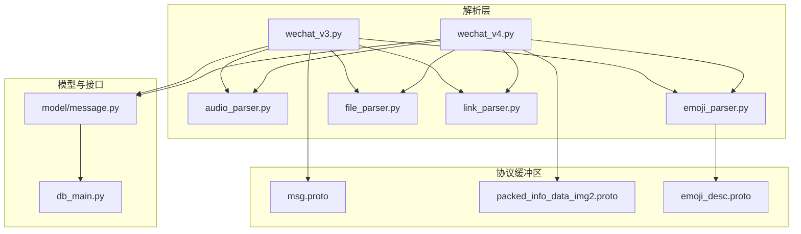
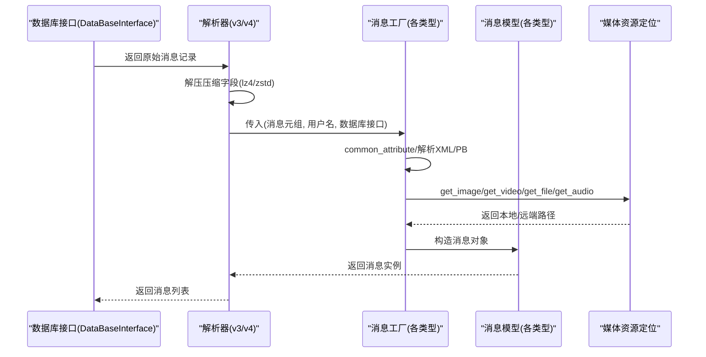
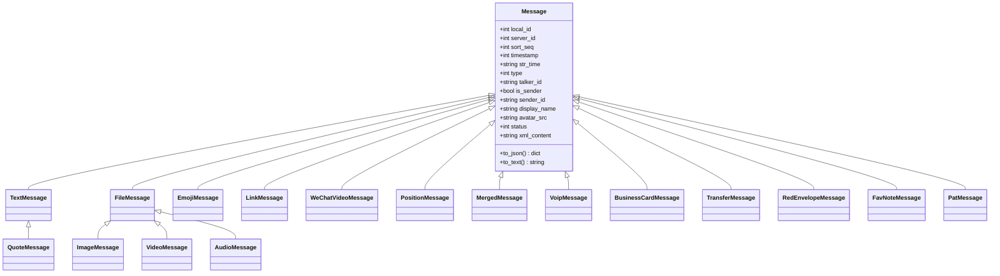
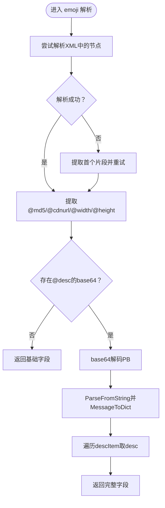
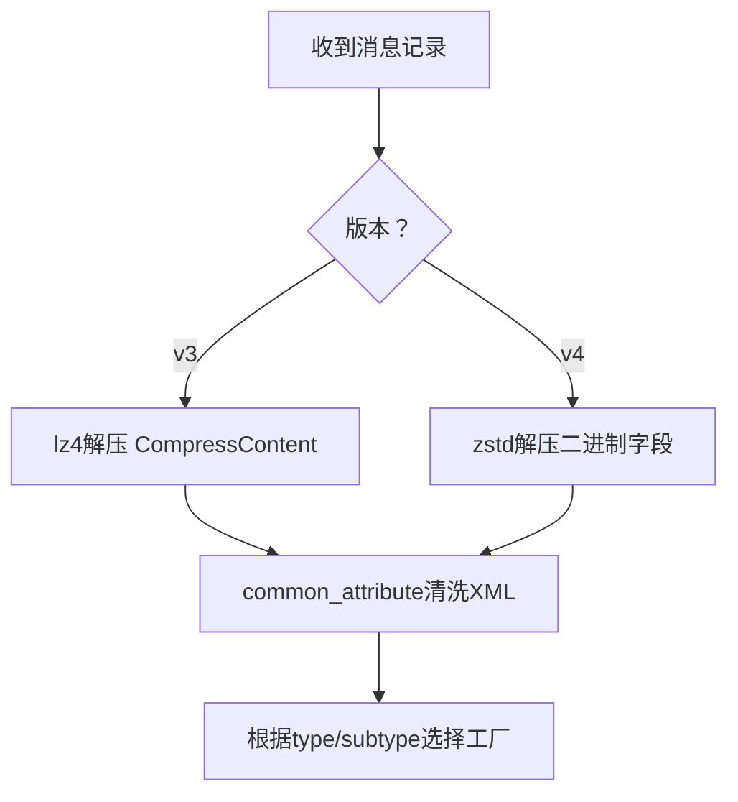
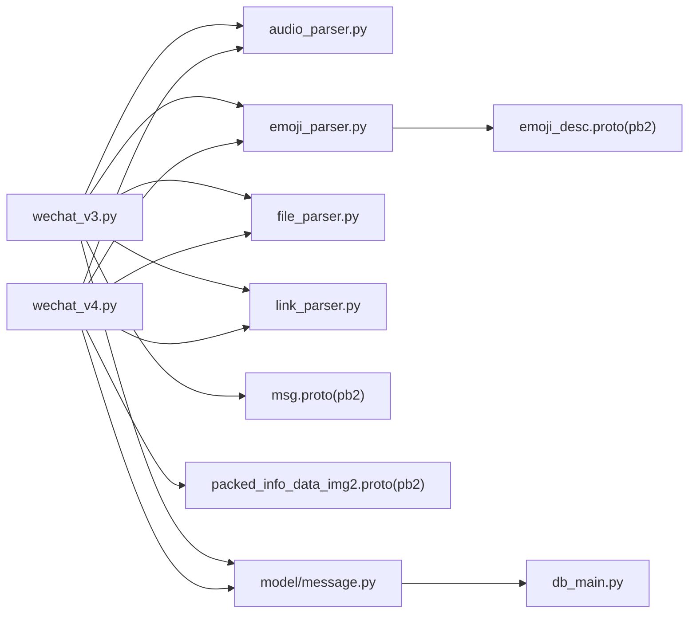

# 消息解析

<cite>
**本文引用的文件**
- [wxManager/parser/wechat_v3.py](file://wxManager/parser/wechat_v3.py)
- [wxManager/parser/wechat_v4.py](file://wxManager/parser/wechat_v4.py)
- [wxManager/parser/audio_parser.py](file://wxManager/parser/audio_parser.py)
- [wxManager/parser/emoji_parser.py](file://wxManager/parser/emoji_parser.py)
- [wxManager/parser/file_parser.py](file://wxManager/parser/file_parser.py)
- [wxManager/parser/link_parser.py](file://wxManager/parser/link_parser.py)
- [wxManager/model/message.py](file://wxManager/model/message.py)
- [wxManager/db_main.py](file://wxManager/db_main.py)
- [wxManager/parser/util/protocbuf/msg.proto](file://wxManager/parser/util/protocbuf/msg.proto)
- [wxManager/parser/util/protocbuf/packed_info_data_img2.proto](file://wxManager/parser/util/protocbuf/packed_info_data_img2.proto)
- [wxManager/parser/util/protocbuf/emoji_desc.proto](file://wxManager/parser/util/protocbuf/emoji_desc.proto)
- [wxManager/parser/__init__.py](file://wxManager/parser/__init__.py)
</cite>

## 目录
1. [简介](#简介)
2. [项目结构](#项目结构)
3. [核心组件](#核心组件)
4. [架构总览](#架构总览)
5. [详细组件分析](#详细组件分析)
6. [依赖分析](#依赖分析)
7. [性能考虑](#性能考虑)
8. [故障排查指南](#故障排查指南)
9. [结论](#结论)
10. [附录](#附录)

## 简介
本文件面向“消息解析模块”，系统性阐述基于 Protocol Buffers 的消息格式定义与解析流程，覆盖文本、图片、语音、视频、文件、表情包、链接/小程序/音乐、名片、音视频通话、位置分享、引用消息、合并转发聊天记录、视频号、红包、转账、收藏笔记、拍一拍等消息类型的解析实现与数据模型。文档同时给出流程控制、错误处理策略、性能优化建议，并提供扩展开发指南与自定义消息类型的添加方法。

## 项目结构
消息解析模块位于 wxManager/parser 目录，按版本与功能分层组织：
- 版本适配：wechat_v3.py、wechat_v4.py 分别对应不同微信版本的消息结构差异
- 协议缓冲区：util/protocbuf 下的 msg.proto、packed_info_data_img2.proto、emoji_desc.proto 等定义二进制结构
- 解析器：audio_parser.py、emoji_parser.py、file_parser.py、link_parser.py 等负责从 XML/二进制中抽取字段
- 模型与接口：model/message.py 定义消息数据类；db_main.py 定义数据库访问接口

**图表来源**
- [wxManager/parser/wechat_v3.py](file://wxManager/parser/wechat_v3.py)
- [wxManager/parser/wechat_v4.py](file://wxManager/parser/wechat_v4.py)
- [wxManager/parser/audio_parser.py](file://wxManager/parser/audio_parser.py)
- [wxManager/parser/emoji_parser.py](file://wxManager/parser/emoji_parser.py)
- [wxManager/parser/file_parser.py](file://wxManager/parser/file_parser.py)
- [wxManager/parser/link_parser.py](file://wxManager/parser/link_parser.py)
- [wxManager/model/message.py](file://wxManager/model/message.py)
- [wxManager/db_main.py](file://wxManager/db_main.py)
- [wxManager/parser/util/protocbuf/msg.proto](file://wxManager/parser/util/protocbuf/msg.proto)
- [wxManager/parser/util/protocbuf/packed_info_data_img2.proto](file://wxManager/parser/util/protocbuf/packed_info_data_img2.proto)
- [wxManager/parser/util/protocbuf/emoji_desc.proto](file://wxManager/parser/util/protocbuf/emoji_desc.proto)

**章节来源**
- [wxManager/parser/__init__.py](file://wxManager/parser/__init__.py)

## 核心组件
- 抽象工厂与单例：MessageFactory 抽象类与继承其的各消息工厂，配合单例缓存联系人与消息，减少重复查询
- 消息模型：Message 及其子类（TextMessage、ImageMessage、AudioMessage、VideoMessage、FileMessage、EmojiMessage、LinkMessage、WeChatVideoMessage、PositionMessage、QuoteMessage、MergedMessage、VoipMessage、BusinessCardMessage、TransferMessage、RedEnvelopeMessage、FavNoteMessage、PatMessage）统一承载字段与序列化能力
- 解析器：audio_parser、emoji_parser、file_parser、link_parser 将 XML/二进制内容解析为字典供工厂构造消息对象
- 协议缓冲区：msg.proto、packed_info_data_img2.proto、emoji_desc.proto 定义二进制结构，通过 pb2 生成物在运行时反序列化
- 数据库接口：db_main.DataBaseInterface 提供图片/视频/文件/语音/表情等资源定位与下载能力

**章节来源**
- [wxManager/parser/wechat_v3.py](file://wxManager/parser/wechat_v3.py)
- [wxManager/parser/wechat_v4.py](file://wxManager/parser/wechat_v4.py)
- [wxManager/model/message.py](file://wxManager/model/message.py)
- [wxManager/db_main.py](file://wxManager/db_main.py)
- [wxManager/parser/util/protocbuf/msg.proto](file://wxManager/parser/util/protocbuf/msg.proto)
- [wxManager/parser/util/protocbuf/packed_info_data_img2.proto](file://wxManager/parser/util/protocbuf/packed_info_data_img2.proto)
- [wxManager/parser/util/protocbuf/emoji_desc.proto](file://wxManager/parser/util/protocbuf/emoji_desc.proto)

## 架构总览
消息解析的整体流程如下：
- 从数据库接口获取原始消息记录（含压缩/二进制字段）
- 根据版本选择 v3 或 v4 解析器
- 对压缩字段进行解压（v3 使用 lz4，v4 使用 zstd）
- 依据消息类型调用对应工厂，工厂内部使用解析器提取 XML 字段，必要时反序列化 PB 结构
- 通过数据库接口定位媒体资源（图片/视频/文件/语音/表情），填充路径与尺寸等信息
- 构造消息对象并缓存，返回给上层

**图表来源**
- [wxManager/parser/wechat_v3.py](file://wxManager/parser/wechat_v3.py)
- [wxManager/parser/wechat_v4.py](file://wxManager/parser/wechat_v4.py)
- [wxManager/db_main.py](file://wxManager/db_main.py)
- [wxManager/model/message.py](file://wxManager/model/message.py)

## 详细组件分析

### 消息类型与模型
消息类型由 MessageType 枚举定义，涵盖文本、图片、语音、视频、文件、表情包、链接/小程序/音乐、名片、音视频通话、位置分享、引用消息、合并转发聊天记录、视频号、红包、转账、收藏笔记、拍一拍等。每种消息类型在 model/message.py 中对应一个 dataclass，包含通用字段（如时间戳、类型、发送者、展示名、头像、状态、XML 内容）与特有字段（如文件路径、缩略图、时长、封面、坐标等）。各类型均提供 to_json/to_text 序列化方法，便于导出与调试。

**图表来源**
- [wxManager/model/message.py](file://wxManager/model/message.py)

**章节来源**
- [wxManager/model/message.py](file://wxManager/model/message.py)

### 协议缓冲区与PB解析
- msg.proto：定义 MessageBytesExtra，包含若干 SubMessage1/SubMessage2，用于从 v3 的二进制字段中提取发送者等信息
- packed_info_data_img2.proto：v4 版本引入的结构，包含 ImageInfo/VideoInfo/AudioInfo/FileInfo/MergeInfo 等，用于直接从二进制中读取文件名、尺寸、语音转文字等信息
- emoji_desc.proto：表情包描述的 PB 结构，emoji_parser 通过 base64 解码后解析，提取多语言描述

**图表来源**
- [wxManager/parser/emoji_parser.py](file://wxManager/parser/emoji_parser.py)
- [wxManager/parser/util/protocbuf/emoji_desc.proto](file://wxManager/parser/util/protocbuf/emoji_desc.proto)

**章节来源**
- [wxManager/parser/util/protocbuf/msg.proto](file://wxManager/parser/util/protocbuf/msg.proto)
- [wxManager/parser/util/protocbuf/packed_info_data_img2.proto](file://wxManager/parser/util/protocbuf/packed_info_data_img2.proto)
- [wxManager/parser/util/protocbuf/emoji_desc.proto](file://wxManager/parser/util/protocbuf/emoji_desc.proto)
- [wxManager/parser/emoji_parser.py](file://wxManager/parser/emoji_parser.py)

### 版本差异与解压策略
- v3：使用 lz4.block.decompress 解压 CompressContent，随后对 XML 进行清理与解析
- v4：使用 zstd.ZstdDecompressor 解压 message[12]/[14] 等二进制字段，PB 结构更丰富，可直接读取文件名、尺寸、语音转文字等

**图表来源**
- [wxManager/parser/wechat_v3.py](file://wxManager/parser/wechat_v3.py)
- [wxManager/parser/wechat_v4.py](file://wxManager/parser/wechat_v4.py)

**章节来源**
- [wxManager/parser/wechat_v3.py](file://wxManager/parser/wechat_v3.py)
- [wxManager/parser/wechat_v4.py](file://wxManager/parser/wechat_v4.py)

### 文本消息解析
- v3：当用户名以 @openim 结尾时，解析 sub_type 并从 appmsg.title 中提取内容；否则直接使用 message[7]
- v4：直接使用清洗后的 message_content
- 工厂将内容写入 TextMessage.content

**章节来源**
- [wxManager/parser/wechat_v3.py](file://wxManager/parser/wechat_v3.py)
- [wxManager/parser/wechat_v4.py](file://wxManager/parser/wechat_v4.py)

### 图片消息解析
- v3：从 XML 中读取 content 与 BytesExtra，调用数据库接口 get_image 获取原图与缩略图路径
- v4：优先尝试从 packed_info_data_img2_pb2 中读取 ImageInfo.filename，若失败回退到旧逻辑；同样通过 get_image 获取路径
- 工厂将 path/thumb_path/file_name/file_type 等写入 ImageMessage

**章节来源**
- [wxManager/parser/wechat_v3.py](file://wxManager/parser/wechat_v3.py)
- [wxManager/parser/wechat_v4.py](file://wxManager/parser/wechat_v4.py)

### 语音消息解析
- 从 XML 中解析 voicemsg/@voicelength 与 voicetrans/@transtext
- v4：若 XML 为空，尝试从 packed_info_data_pb2 中读取 audioTxt
- 工厂将 duration/audio_text 写入 AudioMessage，并设置默认文件名

**章节来源**
- [wxManager/parser/audio_parser.py](file://wxManager/parser/audio_parser.py)
- [wxManager/parser/wechat_v3.py](file://wxManager/parser/wechat_v3.py)
- [wxManager/parser/wechat_v4.py](file://wxManager/parser/wechat_v4.py)

### 视频消息解析
- 从 XML 中解析 videomsg/@md5/@rawmd5/@playlength/@length
- v4：优先根据 filename 推断本地路径；若不存在则回退到硬链接数据库查找
- 工厂将 md5/raw_md5/duration/path/thumb_path 等写入 VideoMessage

**章节来源**
- [wxManager/parser/file_parser.py](file://wxManager/parser/file_parser.py)
- [wxManager/parser/wechat_v3.py](file://wxManager/parser/wechat_v3.py)
- [wxManager/parser/wechat_v4.py](file://wxManager/parser/wechat_v4.py)

### 表情包消息解析
- 从 XML 中解析 @androidmd5/@md5/@cdnurl/@width/@height
- 若 @desc 为 base64 编码，解析 emoji_desc.proto，提取第一条 desc
- 工厂将 url/thumb_url/description/md5 写入 EmojiMessage

**章节来源**
- [wxManager/parser/emoji_parser.py](file://wxManager/parser/emoji_parser.py)
- [wxManager/parser/wechat_v3.py](file://wxManager/parser/wechat_v3.py)
- [wxManager/parser/wechat_v4.py](file://wxManager/parser/wechat_v4.py)

### 链接/小程序/音乐消息解析
- 从 XML 中解析 appmsg/title/des/url/thumburl/songalbumurl/appinfo/appname 等
- 小程序/音乐通过专用解析函数补充 app_icon/cover_url 等字段
- 工厂将 href/title/description/cover_url/app_name/app_icon/app_id 写入 LinkMessage 或 Music 类型

**章节来源**
- [wxManager/parser/link_parser.py](file://wxManager/parser/link_parser.py)
- [wxManager/parser/wechat_v3.py](file://wxManager/parser/wechat_v3.py)
- [wxManager/parser/wechat_v4.py](file://wxManager/parser/wechat_v4.py)

### 名片/音视频通话/位置/引用/合并转发/视频号/红包/转账/收藏笔记/拍一拍
- 名片：解析 @username/@nickname/@alias/@province/@city/@sex/@sign/@bigheadimgurl/@smallheadimgurl 等
- 音视频通话：解析 voipmsg/@type、voiplocalinfo/@duration 等
- 位置：解析 location/@x/@y/@label/@poiname/@scale
- 引用：解析 refermsg/@type/@svrid，通过 get_message_by_server_id 获取被引用消息
- 合并转发：解析 recordinfo/datalist/dataitem，递归构建消息树，按 dir 计算本地路径
- 视频号：解析 finderFeed/@nickname/@avatar/@authIconUrl/@desc/@mediaCount/@mediaList/@coverUrl/@videoPlayDuration
- 红包/转账：解析 wcpayinfo/@paysubtype/@pay_memo/@feedesc/@receiver_username
- 收藏笔记：解析 appmsg/title/des/recorditem
- 拍一拍：解析模板与参与用户

**章节来源**
- [wxManager/parser/link_parser.py](file://wxManager/parser/link_parser.py)
- [wxManager/parser/wechat_v3.py](file://wxManager/parser/wechat_v3.py)
- [wxManager/parser/wechat_v4.py](file://wxManager/parser/wechat_v4.py)

## 依赖分析
- 模块内聚与耦合
  - 解析器（audio_parser、emoji_parser、file_parser、link_parser）与模型（message.py）低耦合，通过字典/字符串输入输出
  - 工厂与数据库接口（db_main.DataBaseInterface）交互，实现资源定位与缓存
  - PB 定义与运行时 pb2 生成物解耦，通过 MessageToDict 转换为 Python 字典
- 外部依赖
  - xmltodict：XML 解析
  - lz4/zstd：压缩解压
  - google.protobuf：PB 反序列化
  - 媒体资源：通过数据库接口提供的 get_* 方法定位

**图表来源**
- [wxManager/parser/wechat_v3.py](file://wxManager/parser/wechat_v3.py)
- [wxManager/parser/wechat_v4.py](file://wxManager/parser/wechat_v4.py)
- [wxManager/parser/audio_parser.py](file://wxManager/parser/audio_parser.py)
- [wxManager/parser/emoji_parser.py](file://wxManager/parser/emoji_parser.py)
- [wxManager/parser/file_parser.py](file://wxManager/parser/file_parser.py)
- [wxManager/parser/link_parser.py](file://wxManager/parser/link_parser.py)
- [wxManager/model/message.py](file://wxManager/model/message.py)
- [wxManager/db_main.py](file://wxManager/db_main.py)
- [wxManager/parser/util/protocbuf/msg.proto](file://wxManager/parser/util/protocbuf/msg.proto)
- [wxManager/parser/util/protocbuf/packed_info_data_img2.proto](file://wxManager/parser/util/protocbuf/packed_info_data_img2.proto)
- [wxManager/parser/util/protocbuf/emoji_desc.proto](file://wxManager/parser/util/protocbuf/emoji_desc.proto)

**章节来源**
- [wxManager/parser/wechat_v3.py](file://wxManager/parser/wechat_v3.py)
- [wxManager/parser/wechat_v4.py](file://wxManager/parser/wechat_v4.py)
- [wxManager/model/message.py](file://wxManager/model/message.py)
- [wxManager/db_main.py](file://wxManager/db_main.py)

## 性能考虑
- 单例缓存
  - 工厂基类维护 contacts 与 messages 的缓存，避免重复查询联系人与消息
  - v4 引入 LimitedDict 控制缓存大小，淘汰最久未使用的条目
- 压缩解压
  - v3 使用 lz4，v4 使用 zstd，解压后立即清洗 XML，减少后续解析成本
- PB 字段直读
  - v4 通过 packed_info_data_img2_pb2 直接读取文件名、尺寸、语音转文字，避免额外解析
- 资源定位
  - 优先使用本地路径推断；若不存在，回退到数据库接口查询，尽量减少 IO

**章节来源**
- [wxManager/parser/wechat_v3.py](file://wxManager/parser/wechat_v3.py)
- [wxManager/parser/wechat_v4.py](file://wxManager/parser/wechat_v4.py)

## 故障排查指南
- XML 解析异常
  - 现象：解析失败或字段缺失
  - 处理：emoji_parser 对异常进行捕获与日志记录；link_parser 对转义字符进行清洗与回退解析
- 压缩字段异常
  - 现象：解压失败或空字符串
  - 处理：v3/v4 均有 try-except 保护，失败时返回空串或默认值
- PB 反序列化异常
  - 现象：base64 编码的 emoji 描述解析失败
  - 处理：emoji_parser 对异常进行捕获与日志记录，保证主流程不中断
- 引用消息缺失
  - 现象：get_message_by_server_id 返回空
  - 处理：工厂构造默认 TextMessage 作为兜底

**章节来源**
- [wxManager/parser/emoji_parser.py](file://wxManager/parser/emoji_parser.py)
- [wxManager/parser/link_parser.py](file://wxManager/parser/link_parser.py)
- [wxManager/parser/wechat_v3.py](file://wxManager/parser/wechat_v3.py)
- [wxManager/parser/wechat_v4.py](file://wxManager/parser/wechat_v4.py)

## 结论
消息解析模块通过“版本适配 + PB/XML 解析 + 工厂模式 + 模型序列化”的架构，实现了对多种微信消息类型的稳定解析与导出。v4 在 PB 字段直读与缓存策略上的改进显著提升了性能与准确性。扩展新消息类型时，遵循现有工厂/解析器/模型的分层设计，即可快速集成。

## 附录

### 扩展开发指南：添加自定义消息类型
- 步骤
  1) 在 model/message.py 中新增消息类，继承自 Message，并实现 to_json/to_text
  2) 在 wechat_v3.py 或 wechat_v4.py 中新增对应工厂类，继承 MessageFactory 与单例基类
  3) 在工厂 create 中：
     - 调用 common_attribute 清洗 XML
     - 使用解析器或 PB 反序列化提取字段
     - 通过数据库接口定位媒体资源
     - 构造消息对象并加入缓存
  4) 在 MessageType 中新增类型枚举值
  5) 如需 PB 支持，编写 .proto 并生成 pb2，或复用现有 pb2
- 注意事项
  - 保持字段命名与模型一致
  - 对异常进行捕获并记录日志
  - 利用缓存避免重复查询
  - 为 v3/v4 分别实现兼容逻辑

**章节来源**
- [wxManager/model/message.py](file://wxManager/model/message.py)
- [wxManager/parser/wechat_v3.py](file://wxManager/parser/wechat_v3.py)
- [wxManager/parser/wechat_v4.py](file://wxManager/parser/wechat_v4.py)
- [wxManager/db_main.py](file://wxManager/db_main.py)