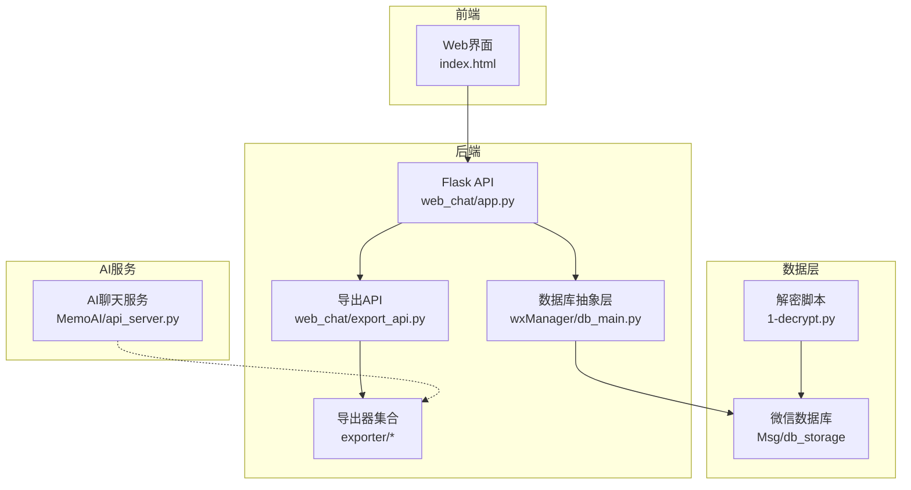
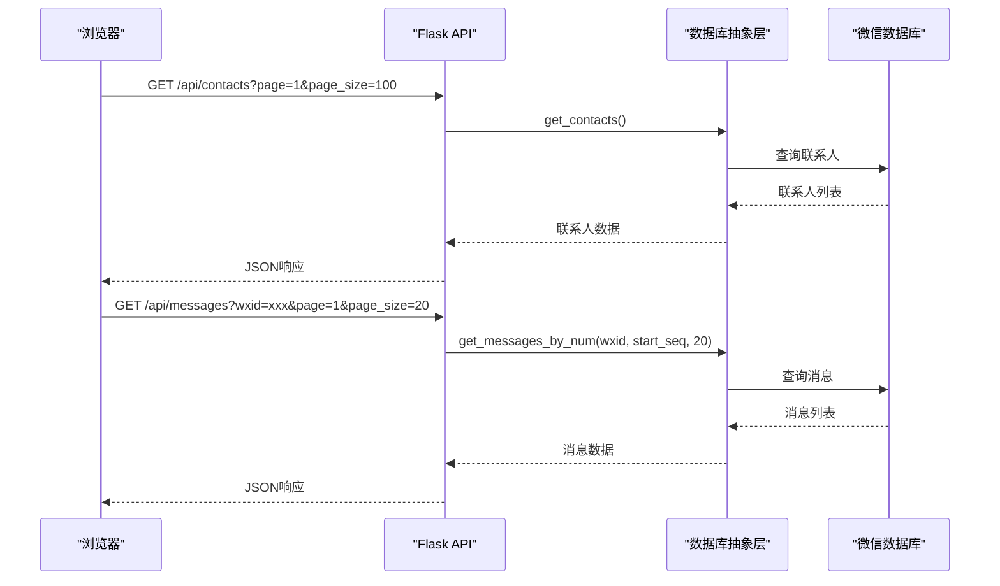
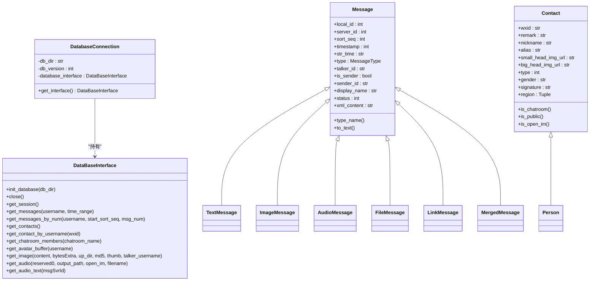
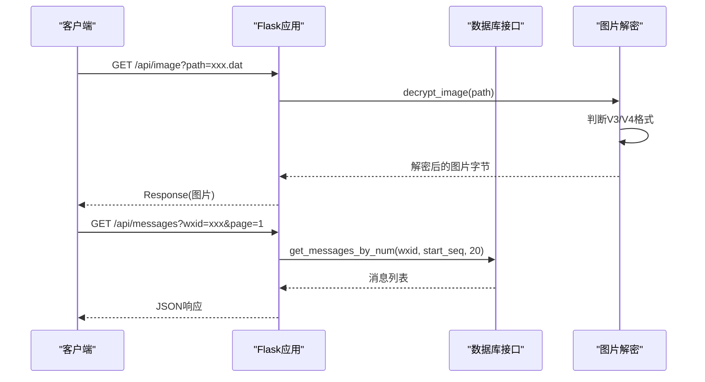
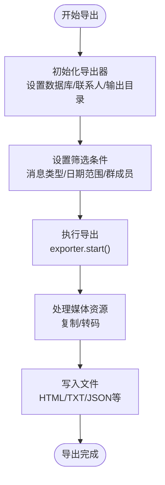
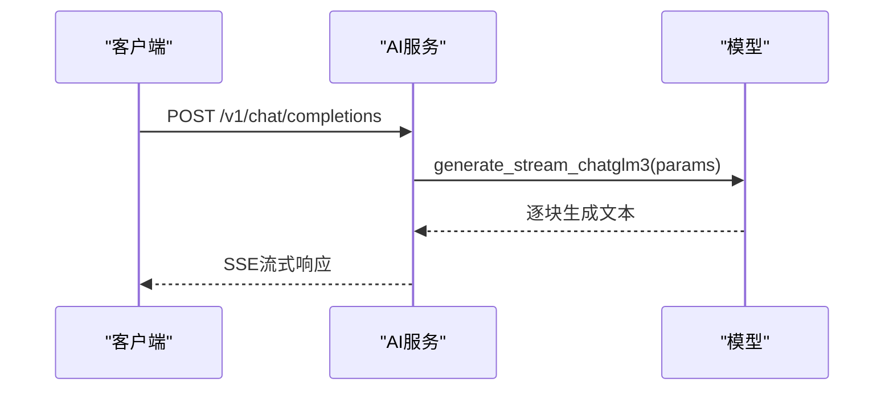
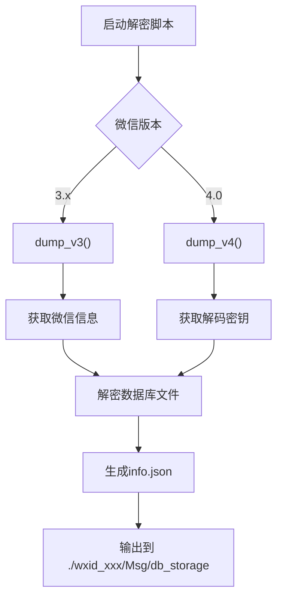
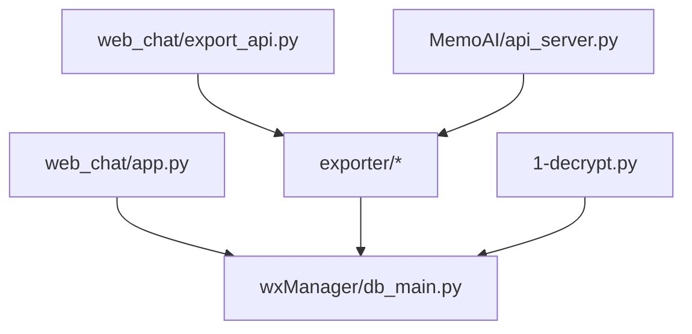

# 项目概述

<cite>
**本文档引用的文件**
- [readme.md](file://readme.md)
- [index.html](file://index.html)
- [1-decrypt.py](file://1-decrypt.py)
- [run_tests.py](file://run_tests.py)
- [doc/开发者手册.md](file://doc/开发者手册.md)
- [wxManager/__init__.py](file://wxManager/__init__.py)
- [web_chat/app.py](file://web_chat/app.py)
- [MemoAI/api_server.py](file://MemoAI/api_server.py)
- [exporter/__init__.py](file://exporter/__init__.py)
- [example/README.md](file://example/README.md)
- [wxManager/db_main.py](file://wxManager/db_main.py)
- [exporter/exporter.py](file://exporter/exporter.py)
- [exporter/config.py](file://exporter/config.py)
- [wxManager/model/message.py](file://wxManager/model/message.py)
- [wxManager/model/contact.py](file://wxManager/model/contact.py)
- [web_chat/export_api.py](file://web_chat/export_api.py)
</cite>

## 目录
1. [简介](#简介)
2. [项目结构](#项目结构)
3. [核心组件](#核心组件)
4. [架构总览](#架构总览)
5. [详细组件分析](#详细组件分析)
6. [依赖关系分析](#依赖关系分析)
7. [性能考量](#性能考量)
8. [故障排查指南](#故障排查指南)
9. [结论](#结论)
10. [附录](#附录)

## 简介
MemoTrace 的核心价值主张是“我的数据我做主”。项目致力于让用户完全掌控自己的微信聊天数据，提供从解密、查看、导出到AI个人助手的完整链路，强调数据隐私保护与用户权利。项目支持微信4.0数据库，具备还原聊天界面、多格式导出、AI训练数据生成、以及年度报告可视化等能力。

- 项目目标：保护用户数据主权，提供安全可控的数据管理与分析工具
- 技术特色：前后端分离Web界面、数据库解密模块、多格式导出、AI聊天服务
- 开源理念：MIT许可，鼓励二次开发与贡献，严格禁止非法用途

**章节来源**
- [readme.md:1-217](file://readme.md#L1-L217)

## 项目结构
项目采用模块化组织，主要分为以下几大模块：
- wxManager：数据库抽象层与微信数据库解析核心
- web_chat：前后端分离的Web聊天界面与API服务
- exporter：多格式导出器集合
- MemoAI：AI聊天服务与训练数据处理
- example：使用示例与流程演示
- doc：开发者手册与设计文档

**图表来源**
- [web_chat/app.py:1-776](file://web_chat/app.py#L1-L776)
- [web_chat/export_api.py:1-421](file://web_chat/export_api.py#L1-L421)
- [wxManager/db_main.py:1-255](file://wxManager/db_main.py#L1-L255)
- [exporter/exporter.py:1-650](file://exporter/exporter.py#L1-L650)
- [1-decrypt.py:1-81](file://1-decrypt.py#L1-L81)
- [MemoAI/api_server.py:1-600](file://MemoAI/api_server.py#L1-L600)

**章节来源**
- [readme.md:48-120](file://readme.md#L48-L120)
- [index.html:1-189](file://index.html#L1-L189)

## 核心组件
- 数据库抽象层（DataBaseInterface）
  - 定义统一的数据库接口规范，支持微信3.x与4.0版本
  - 提供联系人、消息、媒体、语音等查询与导出能力
- Web聊天服务（Flask）
  - 提供联系人列表、聊天记录、图片解密、头像获取等REST API
  - 支持分页、搜索、群成员查询等
- 导出器（Exporter）
  - 支持HTML、TXT、Markdown、Excel、JSON、CSV、DOCX等多种格式
  - 提供批量导出、按消息类型筛选、日期范围过滤等
- AI聊天服务（FastAPI）
  - 提供OpenAI风格的聊天补全与嵌入接口
  - 支持流式输出、工具调用、模型微调部署
- 解密脚本（1-decrypt.py）
  - 自动识别微信版本，解密数据库文件并生成info.json

**章节来源**
- [wxManager/db_main.py:22-255](file://wxManager/db_main.py#L22-L255)
- [web_chat/app.py:260-776](file://web_chat/app.py#L260-L776)
- [exporter/exporter.py:82-650](file://exporter/exporter.py#L82-L650)
- [MemoAI/api_server.py:1-600](file://MemoAI/api_server.py#L1-L600)
- [1-decrypt.py:22-81](file://1-decrypt.py#L22-L81)

## 架构总览
MemoTrace采用前后端分离架构：
- 前端：静态页面index.html，通过AJAX调用后端API
- 后端：Flask提供REST API，内部依赖wxManager进行数据库访问
- 数据层：微信数据库（Msg或db_storage），经1-decrypt.py解密
- 导出层：exporter模块按需生成多种格式文件
- AI层：MemoAI提供聊天与嵌入服务，支持训练数据生成

**图表来源**
- [web_chat/app.py:377-641](file://web_chat/app.py#L377-L641)
- [wxManager/db_main.py:33-122](file://wxManager/db_main.py#L33-L122)

**章节来源**
- [web_chat/app.py:1-776](file://web_chat/app.py#L1-L776)
- [wxManager/__init__.py:19-45](file://wxManager/__init__.py#L19-L45)

## 详细组件分析

### 数据库抽象层（wxManager）
- 设计模式：接口抽象 + 上下文代理
- 核心接口：DataBaseInterface定义了联系人、消息、媒体、统计等统一方法
- 版本适配：DatabaseConnection根据db_version选择DataBaseV3或DataBaseV4
- 消息模型：Message及其子类（Text、Image、Audio、File、Link、Merged等）封装消息类型与渲染

**图表来源**
- [wxManager/db_main.py:22-255](file://wxManager/db_main.py#L22-L255)
- [wxManager/model/message.py:82-654](file://wxManager/model/message.py#L82-L654)
- [wxManager/model/contact.py:44-182](file://wxManager/model/contact.py#L44-L182)

**章节来源**
- [wxManager/db_main.py:1-255](file://wxManager/db_main.py#L1-L255)
- [wxManager/model/message.py:1-654](file://wxManager/model/message.py#L1-L654)
- [wxManager/model/contact.py:1-182](file://wxManager/model/contact.py#L1-L182)

### Web聊天服务（Flask）
- API设计：提供联系人、消息、会话、统计等接口
- 图片解密：支持微信3.x XOR与4.x AES两种解密方式
- 头像获取：统一通过avatar接口返回头像数据
- 导出集成：注册export蓝图，支持多种格式导出

**图表来源**
- [web_chat/app.py:148-375](file://web_chat/app.py#L148-L375)
- [web_chat/app.py:501-605](file://web_chat/app.py#L501-L605)

**章节来源**
- [web_chat/app.py:1-776](file://web_chat/app.py#L1-L776)

### 导出器（exporter）
- 导出格式：HTML、TXT、AI优化TXT、Markdown、Excel、JSON、CSV、DOCX
- 导出流程：初始化导出器 → 设置筛选条件 → start()执行 → 生成文件
- 媒体处理：图片、视频、音频、文件的复制与转码
- 进度控制：支持回调函数与暂停/恢复/取消

**图表来源**
- [exporter/exporter.py:82-177](file://exporter/exporter.py#L82-L177)
- [exporter/exporter.py:592-650](file://exporter/exporter.py#L592-L650)
- [exporter/config.py:4-34](file://exporter/config.py#L4-L34)

**章节来源**
- [exporter/exporter.py:1-650](file://exporter/exporter.py#L1-L650)
- [exporter/config.py:1-34](file://exporter/config.py#L1-L34)

### AI聊天服务（MemoAI）
- API风格：OpenAI兼容的/v1/chat/completions与/v1/embeddings
- 流式输出：支持SSE流式响应
- 模型加载：支持PEFT微调模型与全参模型
- 部署方式：FastAPI + uvicorn，支持本地微调模型部署

**图表来源**
- [MemoAI/api_server.py:231-357](file://MemoAI/api_server.py#L231-L357)
- [MemoAI/api_server.py:426-531](file://MemoAI/api_server.py#L426-L531)

**章节来源**
- [MemoAI/api_server.py:1-600](file://MemoAI/api_server.py#L1-L600)

### 解密脚本（1-decrypt.py）
- 版本检测：自动识别微信3.x与4.0
- 解密流程：获取微信信息 → 生成Me对象 → 调用解密函数 → 输出数据库与info.json
- 输出路径：3.x版本在Msg目录，4.0版本在db_storage目录

**图表来源**
- [1-decrypt.py:22-81](file://1-decrypt.py#L22-L81)

**章节来源**
- [1-decrypt.py:1-81](file://1-decrypt.py#L1-L81)

## 依赖关系分析
- 模块耦合
  - web_chat依赖wxManager进行数据库访问
  - export_api依赖exporter模块进行文件导出
  - MemoAI与exporter可配合生成AI训练数据
- 外部依赖
  - Flask/CORS：Web服务与跨域支持
  - Transformers/PEFT：模型加载与微调
  - pysilk/ffmpeg：音频解码与转码
- 潜在循环依赖
  - 通过蓝图注册避免直接循环导入
  - 导出器按需导入，降低耦合

**图表来源**
- [web_chat/app.py:46-51](file://web_chat/app.py#L46-L51)
- [web_chat/export_api.py:25-51](file://web_chat/export_api.py#L25-L51)
- [exporter/exporter.py:16-17](file://exporter/exporter.py#L16-L17)
- [MemoAI/api_server.py:42-43](file://MemoAI/api_server.py#L42-L43)
- [1-decrypt.py:16-19](file://1-decrypt.py#L16-L19)

**章节来源**
- [web_chat/app.py:1-776](file://web_chat/app.py#L1-L776)
- [web_chat/export_api.py:1-421](file://web_chat/export_api.py#L1-L421)
- [exporter/exporter.py:1-650](file://exporter/exporter.py#L1-L650)
- [MemoAI/api_server.py:1-600](file://MemoAI/api_server.py#L1-L600)
- [1-decrypt.py:1-81](file://1-decrypt.py#L1-L81)

## 性能考量
- 数据库访问
  - 使用分页接口（get_messages_by_num）避免一次性加载大量消息
  - 图片与媒体资源按需解密与复制，减少内存占用
- 导出性能
  - 多线程并发处理媒体文件复制与音频转码
  - 支持批量导出与增量合并，提高效率
- Web服务
  - 图片解密采用按需解密策略，避免重复解密
  - 头像与媒体资源缓存至本地，减少重复IO

[本节为通用性能讨论，无需具体文件引用]

## 故障排查指南
- 常见问题
  - 解密失败：确认微信已重启，确保key可用；检查数据库路径与版本
  - 导出失败：检查导出器依赖（如python-docx），确认输出目录权限
  - 图片无法显示：检查图片路径与解密密钥，确认V3/V4格式识别
- 日志与调试
  - Flask服务端启用详细日志，便于定位数据库连接与图片解密问题
  - 导出器提供进度回调与异常捕获，便于监控导出过程
- 测试运行
  - 使用run_tests.py运行单元测试，覆盖核心模块功能

**章节来源**
- [web_chat/app.py:19-35](file://web_chat/app.py#L19-L35)
- [exporter/exporter.py:134-143](file://exporter/exporter.py#L134-L143)
- [run_tests.py:15-22](file://run_tests.py#L15-L22)

## 结论
MemoTrace以“我的数据我做主”为核心理念，构建了从解密、查看、导出到AI应用的完整数据管理生态。通过前后端分离架构与模块化设计，项目在保障用户数据主权的同时，提供了高效、易用、可扩展的技术方案。面向未来，项目将持续完善微信4.0支持、增强AI个人助手能力，并探索更多数据可视化与分析场景。

[本节为总结性内容，无需具体文件引用]

## 附录
- 使用示例
  - 解密：python 1-decrypt.py
  - 查看联系人：修改db_dir与db_version后运行
  - 导出数据：参考example/README.md中的示例代码
- 开发者手册
  - 详见doc/开发者手册.md与readme.md中的设计文档链接

**章节来源**
- [example/README.md:1-64](file://example/README.md#L1-L64)
- [doc/开发者手册.md:1-5](file://doc/开发者手册.md#L1-L5)
- [readme.md:108-120](file://readme.md#L108-L120)