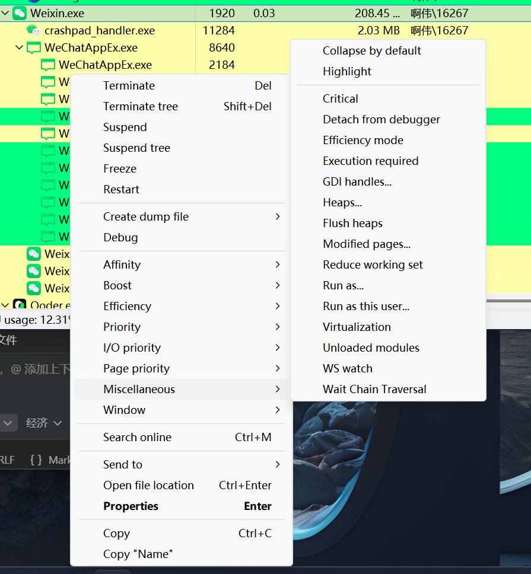

# 微信 4.1.8.29 数据库密钥获取修复指南

## 问题说明

您需要获取微信 4.1.8.29 版本的数据库密钥（32字节 = 64字符十六进制），用于解密 `xwechat_files` 目录下的加密数据库文件。

## 提供的工具

| 文件 | 用途 |
|------|------|
| `fix_db_key_v4.py` | 内存扫描工具，尝试从 Weixin.exe 内存中提取密钥 |
| `1-decrypt-fixed.py` | 修复版解密脚本，支持手动输入密钥 |
| `patch_wx_info_v4.py` | 生成修复 `wx_info_v4.py` 的补丁代码 |
| `quick_diagnose.py` | 环境诊断工具 |

## 快速开始

### 步骤 1: 运行环境诊断

```bash
python quick_diagnose.py
```

这将检查：
- Python 依赖是否安装
- Weixin.exe 是否在运行
- 微信目录结构是否正确

### 步骤 2: 尝试内存扫描获取密钥

**前提**: 微信 4.1.8.29 必须正在运行且已登录

```bash
python fix_db_key_v4.py
```

此脚本会：
1. 基于已知信息（手机号、昵称）生成候选密钥
2. 在 Weixin.exe 内存中扫描密钥特征
3. 通过手机号引用定位附近的密钥
4. 暴力扫描内存中的所有 32 字节序列

**如果找到密钥**，会输出类似：
```
[FOUND] 有效密钥 @ 0x12345678
密钥: a1b2c3d4e5f6...
```

### 步骤 3: 使用密钥解密

#### 方式 A: 自动获取成功

如果 `fix_db_key_v4.py` 成功找到密钥，复制该密钥并编辑 `1-decrypt-fixed.py`：

```python
# 在文件开头找到这一行
MANUAL_KEY_V4 = ""  # <-- 在这里填入密钥

# 修改为
MANUAL_KEY_V4 = "a1b2c3d4e5f6..."  # 填入完整的64字符密钥
```

然后运行：
```bash
python 1-decrypt-fixed.py
# 选择模式 2 (手动设置密钥)
```

#### 方式 B: 从其他渠道获取密钥

如果您从其他渠道（如微信 3.5.9.55 版本的备份）获得了密钥，直接填入 `MANUAL_KEY_V4`。

**注意**: 不同微信版本的密钥通常不同，3.5.9.55 的密钥很可能无法在 4.1.8.29 上使用。

### 步骤 4: 如果内存扫描失败

如果 `fix_db_key_v4.py` 未能找到密钥，可以尝试：

#### 方案 1: 更新 YARA 规则

查看 `patch_wx_info_v4.py` 输出的修复建议，手动修改 `wxManager/decrypt/wx_info_v4.py`：

1. 找到 `get_key_inner` 函数
2. 更新 `rules_v4_key` 变量，添加新的匹配模式
3. 重新运行 `1-decrypt.py`

#### 方案 2: 暴力扫描增强

修改 `fix_db_key_v4.py` 中的扫描参数：

```python
# 增加扫描区域数量
for base_addr, size in regions[:200]:  # 从 100 改为 200

# 或者增加扫描步长精度
for offset in range(0, len(memory) - 32, 4):  # 从 8 改为 4
```

#### 方案 3: 使用 Process Hacker 手动查找

1. 下载并运行 [Process Hacker](https://processhacker.sourceforge.io/)
2. 找到 Weixin.exe 进程
3. 搜索已知的特征：
   - 手机号 UTF-16LE: `310038003200300036003000370034003000320036003400`
   - 昵称 UTF-16LE: `554A04FF6770`
4. 在附近查找 32 字节的随机数据（可能是密钥）

## 已知信息分析

您提供的信息：
- **微信版本**: 4.1.8.29
- **手机号**: 18206740264
- **昵称**: 啊伟
- **微信目录**: `G:\微信\xwechat_files\wxid_5e3hd0zrse6w22_c8c9`
- **参考密钥 (3.5.9.55)**: `c9eaed112cbb4dd896a5dd7314186a24598951f2efff4afe812fb7556f4fc4ce`

### 密钥可能性分析

1. **密钥派生**: 微信 4.x 使用 PBKDF2-HMAC-SHA512，从用户密码派生密钥
2. **密钥存储**: 密钥在运行时会保存在内存中，通常是 32 字节的随机数据
3. **版本差异**: 4.1.8.29 与 3.5.9.55 的密钥大概率不同

### 反推方法

由于密钥是随机生成的，**无法从已知信息（手机号、昵称）数学反推**。

唯一的方法是：
1. 从内存中读取（需要微信正在运行）
2. 从备份中恢复（如果有之前的备份）
3. 使用相同的登录凭据在其他设备上获取

## 常见问题

### Q: 为什么 3.5.9.55 的密钥无法使用？

A: 微信每次登录会生成新的随机密钥，不同版本、不同登录会话的密钥都不同。

### Q: 微信必须运行吗？

A: 是的，密钥只保存在内存中。微信关闭后密钥会丢失，除非您之前保存过。

### Q: 内存扫描安全吗？

A: 只读取内存，不修改，理论上安全。但请注意：
- 不要使用来路不明的工具
- 不要分享您的密钥给他人
- 仅在个人数据备份场景使用

### Q: 如果所有方法都失败了？

A: 可能的解决方案：
1. 检查微信版本是否为官方正式版（非测试版/内测版）
2. 尝试重启微信后再次扫描
3. 使用管理员权限运行脚本
4. 检查是否有安全软件阻止内存读取
5. 联系微信数据恢复专业人员

## 技术细节

### 密钥验证原理

微信数据库使用 SQLCipher 加密，验证密钥的步骤：

1. 读取数据库文件前 4096 字节（第一页）
2. 提取前 16 字节作为 salt
3. 使用 PBKDF2 派生密钥: `PBKDF2(key, salt, 256000, SHA512)`
4. 计算 HMAC-SHA512 并与文件中的值比较
5. 如果匹配，密钥正确

### 内存扫描原理

密钥在内存中的特征：
- 32 字节长度
- 随机数据（熵值高）
- 前面可能有特定标记: `00 00 00 00 00 00 00 20 00 00 00 00 00 00 00 2f`
- 可能与手机号、昵称等用户信息在同一内存区域

## 联系支持

如果您在修复过程中遇到问题：
1. 保存所有脚本的输出日志
2. 记录微信版本号和操作系统版本
3. 提供尽可能多的上下文信息

---

**免责声明**: 本工具仅供个人数据备份使用。使用本工具产生的一切后果由使用者自行承担。
